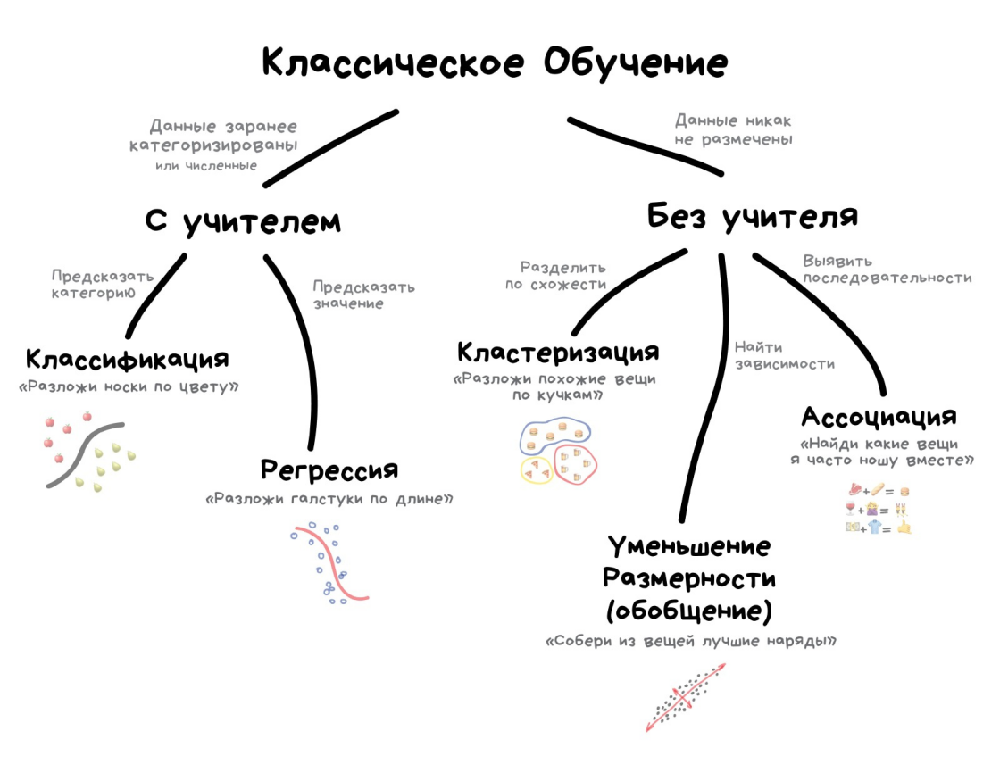
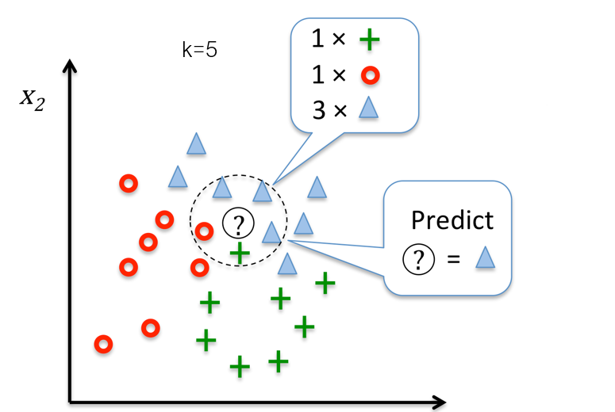
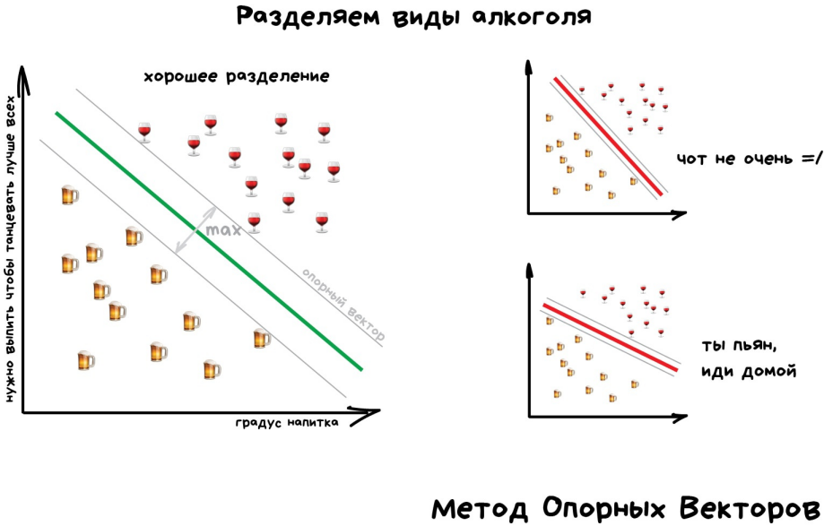
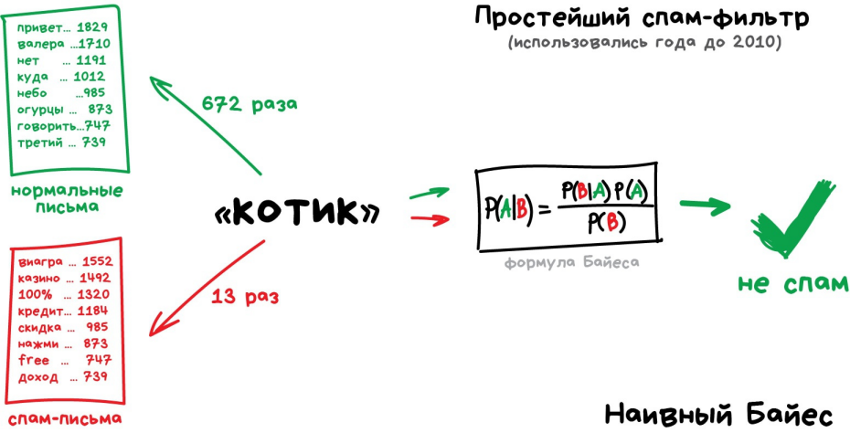
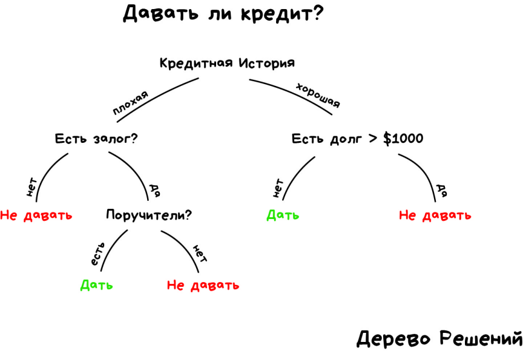
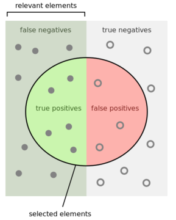
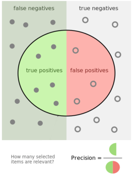
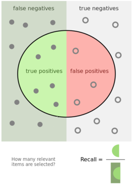

---
jupyter:
  jupytext:
    text_representation:
      extension: .md
      format_name: markdown
      format_version: '1.3'
      jupytext_version: 1.16.4
  kernelspec:
    display_name: Python 3 (ipykernel)
    language: python
    name: python3
---

<!-- #region editable=true jupyterlab-deck={"layer": "deck"} slideshow={"slide_type": "slide"} -->
# Лекция 8: Классификация. Метрики качества

Машинное обучение и анализ данных

МГТУ им. Н.Э. Баумана

Красников Александр Сергеевич

2024
<!-- #endregion -->

```python editable=true jupyterlab-deck={"layer": "slide"} slideshow={"slide_type": "slide"}
import itertools
import matplotlib.pyplot as plt
from matplotlib.pylab import rc, plot
import mglearn
import numpy as np
import pandas as pd
import seaborn as sns

from sklearn.linear_model import LogisticRegression
from sklearn.metrics import confusion_matrix
from sklearn.metrics import classification_report
from sklearn.metrics import precision_recall_curve
from sklearn.metrics import roc_auc_score
from sklearn.metrics import auc
from sklearn.metrics import roc_curve
from sklearn.metrics import log_loss
from sklearn.model_selection import train_test_split
from sklearn.preprocessing import LabelEncoder, OneHotEncoder
```

<!-- #region editable=true slideshow={"slide_type": "slide"} -->

<!-- #endregion -->

<!-- #region editable=true jp-MarkdownHeadingCollapsed=true slideshow={"slide_type": "slide"} -->
## Постановка задачи классификации

Классификация направлена на предсказание категориальных меток (классов) для входных данных.

Для выявления закономерностей между признаками и классами модель обучается на **обучающей выборке**, где каждому примеру соответствует известный класс

Модель оценивается на **тестовой выборке** для проверки ее точности и способности обобщать на новых данных.
<!-- #endregion -->

<!-- #region editable=true jp-MarkdownHeadingCollapsed=true slideshow={"slide_type": "slide"} -->
## Примеры задач классификации

- Спам-фильтры
- Определение языка текста
- Классификация статей по жанрам
- Анализ тональности (комментариев)
- Распознавание рукописных букв и цифр
- Определение подозрительных транзакций

<!-- #endregion -->

<!-- #region editable=true slideshow={"slide_type": "slide"} -->
## Типы алгоритмов (методов) классификации

- Метрические методы
- Параметрические методы
- Логические методы классификации
<!-- #endregion -->

<!-- #region editable=true slideshow={"slide_type": "subslide"} -->
### Метрические методы классификации

<!-- #endregion -->

<!-- #region editable=true slideshow={"slide_type": "subslide"} -->
Метрические методы классификации основаны на расстояниях между объектами выборки (точками данных).

Основные метрические методы классификации включают:

- Метод k-ближайших соседей (k-NN):
  - определяет класс объекта на основе классов его k ближайших соседей;
  - Расстояние может измеряться с использованием метрик, таких как евклидово или манхэттенское расстояние, расстояние Левенштейна, ...

- Гауссовский процесс (Gaussian process):
  - Моделирует данные с использованием многомерного нормального распределения и использует расстояния для предсказания классов.

Методы могут быть чувствительны к выбору метрики расстояния и гиперпараметров (например, значения k в k-NN), а также к размерности пространства.
<!-- #endregion -->

<!-- #region editable=true slideshow={"slide_type": "subslide"} -->
### Параметрические методы классификации

<!-- #endregion -->

<!-- #region editable=true slideshow={"slide_type": ""} -->

<!-- #endregion -->

<!-- #region editable=true slideshow={"slide_type": "subslide"} -->
Параметрические методы классификации основаны на предположениях о распределении данных и используют фиксированное количество параметров для описания модели.

Основные параметрические методы классификации:

- Логистическая регрессия (Logistic regression):
  - Используется для бинарной классификации;
  - Моделирует вероятность принадлежности к классу с помощью логистической функции.
- Наивный байесовский классификатор (Naive Bayes classifiers):
  - Основывается на применении теоремы Байеса с предположением о независимости признаков.
  - Эффективен для классификации текстов и работы с большими объемами данных.
- Метод опорных векторов (Support vector machine):
  - нахождении оптимальной гиперплоскости, которая разделяет классы данных с максимальным отступом (margin) между ними.

Параметрические методы обычно требуют меньше данных для обучения и более просты в интерпретации, но могут плохо работать, если предположения о распределении данных не оправдываются.
<!-- #endregion -->

<!-- #region editable=true slideshow={"slide_type": "subslide"} -->
### Логические методы классификации

<!-- #endregion -->

<!-- #region editable=true slideshow={"slide_type": "subslide"} -->
Логические методы классификации используют логические выражения и правила для определения класса объектов.

Эти методы часто применяются в задачах, где данные могут быть представлены в виде логических условий.

Основные логические методы классификации включают:

- Деревья решений (Decision tree):
  - Представляют данные в виде дерева, где каждый узел соответствует тесту на признак, а листья &mdash; классам.
  - Легки для интерпретации и визуализации, что помогает понять процесс принятия решений.

- Алгоритмы на основе случаев (Case-based reasoning):
  - Классифицируют объекты, основываясь на анализе ранее встречавшихся случаев, используя критерии схожести.
  - Решают классификационные задачи, применяя логические правила, основанные на аналогиях.

Логические методы классификации помогают моделировать сложные отношения между данными с использованием простых и интерпретируемых структур, однако их эффективность может зависеть от качества и полноты исходных данных.
<!-- #endregion -->

<!-- #region editable=true slideshow={"slide_type": "slide"} -->
## Задача - пример

Для наглядного представления метрик будем использовать датасет по оттоку клиентов телеком-оператора.
<!-- #endregion -->

```python editable=true slideshow={"slide_type": "fragment"}
data = pd.read_csv('./data/telecom_churn.csv')
data.head(5)
```

```python editable=true slideshow={"slide_type": "subslide"}
# Предобработка данных

# маппинг бинарных колонок
d = {'yes' : 1, 'no' : 0}

data['international plan'] = data['international plan'].map(d)
data['voice mail plan'] = data['voice mail plan'].map(d)
data['churn'] = data['churn'].astype('int64')

# закодируем dummy-кодированием штат
# для моделей на основе деревьев так лучше не делать
le = LabelEncoder()
data['state'] = le.fit_transform(data['state'])
ohe = OneHotEncoder(sparse_output=False)
encoded_state = ohe.fit_transform(data['state'].values.reshape(-1, 1))
tmp = pd.DataFrame(encoded_state,
                   columns=['state ' + str(i) for i in range(encoded_state.shape[1])])
data = pd.concat([data, tmp], axis=1)

# удаляем номер телефона (уникальный бесполезный признак)
data.drop(columns=['phone number'], inplace=True)

data.head(5)
```

```python editable=true slideshow={"slide_type": "subslide"}
# Применение логистической регрессии для решения задачи классификации

X = data.drop(columns=['churn'])
y = data.loc[:, ['churn']].values.ravel()

# делим выборку на train и test, все метрики будем оценивать на тестовом датасете
X_train, X_test, y_train, y_test = train_test_split(X, y, stratify=y, test_size=0.33, random_state=42)

# обучаем логистическую регрессию
lr = LogisticRegression(random_state=42, solver='newton-cholesky')
lr.fit(X_train, y_train);

# предсказание класса (0 или 1)
y_pred_bin = lr.predict(X_test)
print('Выборка каждого тридцатого элемента из y_pred_bin:', y_pred_bin[::30])

# предсказание вероятности положительного класса (клиент ушел)
y_pred_probs = lr.predict_proba(X_test)[:,1]
print('Выборка каждого тридцатого элемента из y_pred_probs:', np.round(y_pred_probs, 2)[::30])
```

<!-- #region editable=true slideshow={"slide_type": "slide"} -->
## Оценка и улучшение качества модели
<!-- #endregion -->

<!-- #region editable=true slideshow={"slide_type": "slide"} -->
### Перекрестная проверка (k-fold cross-validation)
<!-- #endregion -->

```python editable=true slideshow={"slide_type": "fragment"}
mglearn.plots.plot_cross_validation()
```

```python editable=true slideshow={"slide_type": "fragment"}
from sklearn.model_selection import cross_val_score

scores = cross_val_score(lr, X, y, cv=5)

print(f'Количество итераций: {len(scores)}')
print(f'Средняя правильность: {scores.mean():.2f}')
print(f'Значения правильности:\n{scores}')
```

<!-- #region editable=true slideshow={"slide_type": "slide"} -->
### Стратифицированная k-блочная перекрестная проверка (Stratified Cross-validation)
<!-- #endregion -->

```python editable=true slideshow={"slide_type": "fragment"}
mglearn.plots.plot_stratified_cross_validation()
```

```python editable=true slideshow={"slide_type": "fragment"}
from sklearn.model_selection import KFold

kfold = KFold(n_splits=5, shuffle=True, random_state=42)
scores = cross_val_score(lr, X, y, cv=kfold)

print(f'Количество итераций: {len(scores)}')
print(f'Средняя правильность: {scores.mean():.2f}')
print(f'Значения правильности:\n{scores}')
```

<!-- #region editable=true slideshow={"slide_type": "slide"} -->
### Перекрестная проверка с исключением по одному (leave-one-out)
<!-- #endregion -->

```python editable=true slideshow={"slide_type": "fragment"}
# !!! Осторожно. Очень долго
from sklearn.model_selection import LeaveOneOut

loo = LeaveOneOut()
scores = cross_val_score(lr, X, y, cv=loo)

print(f'Количество итераций: {len(scores)}')
print(f'Средняя правильность: {scores.mean():.2f}')
print(f'Значения правильности:\n{scores}')
```

<!-- #region editable=true slideshow={"slide_type": "slide"} -->
### Перекрестная проверка со случайными перестановками при разбиении (shuffle-split cross-validation).
<!-- #endregion -->

```python editable=true slideshow={"slide_type": "fragment"}
mglearn.plots.plot_shuffle_split()
```

```python editable=true slideshow={"slide_type": "fragment"}
from sklearn.model_selection import ShuffleSplit

shuffle_split = ShuffleSplit(test_size=.5, train_size=.5, n_splits=10)
scores = cross_val_score(lr, X, y, cv=shuffle_split)

print(f'Количество итераций: {len(scores)}')
print(f'Средняя правильность: {scores.mean():.2f}')
print(f'Значения правильности:\n{scores}')
```

<!-- #region editable=true slideshow={"slide_type": "slide"} -->
### Перекрестная проверка с использованием групп (GroupKFold)
<!-- #endregion -->

```python editable=true slideshow={"slide_type": "fragment"}
mglearn.plots.plot_group_kfold()
```

```python editable=true slideshow={"slide_type": "fragment"}
from sklearn.model_selection import GroupKFold
from sklearn.datasets import make_blobs

# создаем синтетический набор данных
X_, y_ = make_blobs(n_samples=12, random_state=42)
# предположим, что первые три примера относятся к одной и той же группе,
# затем следующие четыре и так далее.
groups = [0, 0, 0, 1, 1, 1, 1, 2, 2, 3, 3, 3]

scores = cross_val_score(lr, X=X_, y=y_, groups=groups, cv=GroupKFold(n_splits=3))


print(f'Количество итераций: {len(scores)}')
print(f'Средняя правильность: {scores.mean():.2f}')
print(f'Значения правильности:\n{scores}')
```

<!-- #region editable=true slideshow={"slide_type": "slide"} -->
### Простой поиск по сетке


<!-- #endregion -->

```python editable=true slideshow={"slide_type": "fragment"}
# реализация простого поиска по сетке
from sklearn.svm import SVC

X_train, X_test, y_train, y_test = train_test_split(X, y, test_size=0.33, random_state=42)

print(f'Размер обучающего набора: {X_train.shape[0]} размер тестового набора: {X_test.shape[0]}')

best_score = 0
for gamma in [0.001, 0.01, 0.1, 1, 10, 100]:
    for C in [0.001, 0.01, 0.1, 1, 10, 100]:
        # для каждой комбинации параметров обучаем SVC
        svm = SVC(gamma=gamma, C=C)
        svm.fit(X_train, y_train)
        # оцениваем качество SVC на тестовом наборе
        score = svm.score(X_test, y_test)
        # если получаем наилучшее значение правильности, сохраняем значение и параметры
        if score > best_score:
            best_score = score
            best_parameters = {'C': C, 'gamma': gamma}

print(f'Наилучшее значение правильности: {best_score:.2f}')
print(f'Наилучшие значения параметров: {best_parameters}')
```

<!-- #region editable=true slideshow={"slide_type": "slide"} -->
### Опасность переобучения и проверочный набор данных
<!-- #endregion -->

```python editable=true slideshow={"slide_type": "fragment"}
mglearn.plots.plot_threefold_split()
```

<!-- #region editable=true slideshow={"slide_type": "slide"} -->
### Поиск по сетке с перекрестной проверкой
<!-- #endregion -->

```python editable=true slideshow={"slide_type": "fragment"}
from sklearn.svm import SVC

# разбиваем данные на обучающий+проверочный набор и тестовый набор
X_trainval, X_test, y_trainval, y_test = train_test_split(X, y, test_size=0.33, random_state=42)
# разбиваем обучающий+проверочный набор на обучающий и проверочный наборы
X_train, X_valid, y_train, y_valid = train_test_split(X_trainval, y_trainval, random_state=42)

print(f'Размер обучающего набора: {X_train.shape[0]}')
print(f'Размер проверочного набора: {X_valid.shape[0]}')
print(f'Размер тестового набора: {X_test.shape[0]}')

best_score = 0
for gamma in [0.001, 0.01, 0.1, 1, 10, 100]:
    for C in [0.001, 0.01, 0.1, 1, 10, 100]:
        # для каждой комбинации параметров обучаем SVC
        svm = SVC(gamma=gamma, C=C)
        svm.fit(X_train, y_train)
        # оцениваем качество SVC на тестовом наборе
        score = svm.score(X_valid, y_valid)
        # если получаем наилучшее значение правильности, сохраняем значение и параметры
        if score > best_score:
            best_score = score
            best_parameters = {'C': C, 'gamma': gamma}

# заново строим модель на наборе, полученном в результате объединения обучающих
# и проверочных данных, оцениваем качество модели на тестовом наборе
svm = SVC(**best_parameters)
svm.fit(X_trainval, y_trainval)
test_score = svm.score(X_test, y_test)

print(f'\nЛучшее значение правильности на проверочном наборе: {best_score:.2f}')
print(f'Наилучшие значения параметров: {best_parameters}')
print(f'Правильность на тестовом наборе с наилучшими параметрами: {test_score:.2f}')
```

```python editable=true slideshow={"slide_type": "subslide"}
mglearn.plots.plot_cross_val_selection()
```

```python editable=true slideshow={"slide_type": "subslide"}
mglearn.plots.plot_grid_search_overview()
```

```python editable=true slideshow={"slide_type": "subslide"}
from sklearn.model_selection import GridSearchCV
from sklearn.svm import SVC

param_grid = {'C': [0.001, 0.01, 0.1, 1, 10, 100],
              'gamma': [0.001, 0.01, 0.1, 1, 10, 100]}
print(f'Сетка параметров:\n{param_grid}')

grid_search = GridSearchCV(SVC(), param_grid, cv=5)

X_train, X_test, y_train, y_test = train_test_split(X, y, test_size=0.33, random_state=42)
grid_search.fit(X_train,y_train)

print(f'Правильность на тестовом наборе: {grid_search.score(X_test, y_test):.2f}')
print(f'Наилучшие значения параметров: {grid_search.best_params_}')
print(f'Наилучшее значение кросс-валидац. правильности:{grid_search.best_score_:.2f}')

print(f'Наилучшая модель:\n{grid_search.best_estimator_}')
```

<!-- #region editable=true slideshow={"slide_type": "slide"} -->
## Метрики качества в задаче классификации

Метрики качества в задаче классификации используются для оценки эффективности алгоритмов классификации с различных точек зрения и выбора наилучшего метода для конкретной задачи.


<!-- #endregion -->

```python editable=true slideshow={"slide_type": "fragment"}
# восстанавливаем параметры задачи-примера

X = data.drop(columns=['churn'])
y = data.loc[:, ['churn']].values.ravel()

# делим выборку на train и test, все метрики будем оценивать на тестовом датасете
X_train, X_test, y_train, y_test = train_test_split(X, y, stratify=y, test_size=0.33, random_state=42)

# обучаем логистическую регрессию
lr = LogisticRegression(random_state=42, solver='newton-cholesky')
lr.fit(X_train, y_train);

# предсказание класса (0 или 1)
y_pred_bin = lr.predict(X_test)
print('Выборка каждого тридцатого элемента из y_pred_bin:', y_pred_bin[::30])

# предсказание вероятности положительного класса (клиент ушел)
y_pred_probs = lr.predict_proba(X_test)[:,1]
print('Выборка каждого тридцатого элемента из y_pred_probs:', np.round(y_pred_probs, 2)[::30])
```

<!-- #region editable=true slideshow={"slide_type": "subslide"} -->
### Виды ошибок классификации
Ошибки классификации бывают двух видов:

- **Ложноположительный результат** (**False Positive (FP)**) &mdash; это ошибка в бинарной классификации, при которой результат теста неверно указывает на наличие какого-либо состояния, когда его на самом деле нет. Например, болезни когда заболевания нет.
- **Ложноотрицательный результат** (**False Negative (FN)**) &mdash; это противоположная ошибка, когда результат теста неверно указывает на отсутствие какого-либо состояния, когда оно самом деле есть. Например, отсутствие болезни когда заболевания нет.

| ML название         | Правильный ответ | Ответ классификатора | Статистическое название  |
|---------------------|:----------------:|:--------------------:|--------------------------|
| True Positive (TP)  | $y_i = 1$        | $\hat{y}_i = 1$      | Правильная классификация |
| True Negative (TN)  | $y_i = 0$        | $\hat{y}_i = 0$      | Правильная классификация |
| False Positive (FP) | $y_i = 0$        | $\hat{y}_i = 1$      | Ошибка I-го рода         |
| False Negative(FN)  | $y_i = 1$        | $\hat{y}_i = 0$      | Ошибка II-го рода        |

Здесь $\hat{y}_i$ &mdash; это ответ алгоритма на $i$-том объекте, а $y_i$ &mdash; истинная метка класса на этом объекте.


<!-- #endregion -->

```python editable=true slideshow={"slide_type": "subslide"}
# вычисляем матрицу ошибок
conf_matrix = confusion_matrix(y_true=y_test, y_pred=y_pred_bin)

# Отрисовывыем матрицу ошибок
fig, ax = plt.subplots(figsize=(7.5, 7.5))
ax.matshow(conf_matrix, cmap=plt.cm.Blues, alpha=0.3)
for i in range(conf_matrix.shape[0]):
    for j in range(conf_matrix.shape[1]):
        ax.text(x=j, y=i,s=conf_matrix[i, j], va='center', ha='center', size='xx-large')

plt.xlabel('Предсказанные метки', fontsize=18)
plt.ylabel('Правильные метки', fontsize=18)
plt.title('Матрица ошибок', fontsize=18)
plt.show()
```

<!-- #region editable=true slideshow={"slide_type": "subslide"} -->
### Матрица ошибок

**Матрица ошибок (Confusion Matrix)** &mdash; таблица, которая показывает количество правильно и неправильно классифицированных примеров для каждого класса, что позволяет более детально анализировать ошибки.

|         | $\hat{y} = 0$      | $\hat{y} = 1$       |
|---------|--------------------|---------------------|
| $y = 0$ | True Negative (TN) | False Positive (FP) |
| $y = 1$ | False Negative(FN) | True Positive (TP)  |
<!-- #endregion -->

<!-- #region editable=true slideshow={"slide_type": "subslide"} -->
### **Правильность (Accuracy)**
**Правильность (Accuracy)** определяет долю правильно классифицированных объектов от общего числа объектов:
$$\text{accuracy} = \frac{TP + TN}{TP + TN + FP + FN}$$

- интуитивно понятная метрика
- используется редко
- бесполезна в задачах с неравными классами

**Пример:**
Из 1000 не-спам писем классификатор верно определил 900 (True Negative = 900, False Positive = 100), а из 100 спам-писем &mdash; 50 (True Positive = 50, False Negative = 50):
$$\text{accuracy} = \frac{50 + 900}{50 + 900 + 100 + 50} = 0,864.$$
Если все письма предсказывать как не-спам, то
$$\text{accuracy} = \frac{0 + 1000}{0 + 1000 + 0 + 100} = 0,909.$$
<!-- #endregion -->

<!-- #region editable=true slideshow={"slide_type": "subslide"} -->
### Точность (Precision)
**Точность (Precision)** определяет долю правильно классифицированных положительных примеров среди всех предсказанных положительных:
$$\text{precision} = \frac{TP}{TP + FP}$$



- полезна в случаях, когда важно минимизировать количество ложных положительных результатов
- не позволяет записывать все объекты в один класс, так как в этом случае растет уровень False Positive
- демонстрирует способность алгоритма отличать данный класс от других
- не зависит от соотношения классов и потому применима в условиях несбалансированных выборок
<!-- #endregion -->

<!-- #region editable=true slideshow={"slide_type": "subslide"} -->
### Полнота (Recall)
**Полнота (Recall)**  или **Чувствительность** (**Sensitivity**) определяет долю правильно классифицированных положительных примеров среди всех фактических положительных примеров:
$$\text{recall} = \frac{TP}{TP + FN}$$

**Специфичность (Specificity)** определяет долю правильно классифицированных отрицательных примеров среди всех фактических отрицательных примеров.
$$\text{specificity} = \frac{TN}{TN + FP}$$



- полезна в случаях, когда важно минимизировать количество ложно отрицательных срабатываний.
- демонстрирует способность алгоритма вообще обнаруживать данный класс
- не зависит от соотношения классов и потому применима в условиях несбалансированных выборок
- полноту для положительного класса называют **чувствительностью** (**sensitivity**)
- полноту для отрицательного класса называют **спецификой** (**specificity**)
<!-- #endregion -->

<!-- #region editable=true slideshow={"slide_type": "subslide"} -->
### $F_{\beta}$-мера ($F_{\beta}$-score)
**F-мера (F-score)** &mdash; один из способов объеденить точность и полноту.
$$\text{F}_{\beta} = \left(1 + \beta^2\right) \cdot 
\frac
{\text{precision} \cdot \text{recall}}
{\left( \beta^2 \cdot \text{precision} \right) + \text{recall}}$$

При $\beta = 1$ это среднее гармоническое (с множителем 2, чтобы в случае precision = 1 и recall = 1 иметь $\ F_1 = 1$)
$$\text{F-score} = 2 \cdot \frac{\text{precision} \cdot \text{recall}}{\text{precision} + \text{recall}}$$

- обеспечивает баланс между точностью и полнотой
- $\beta$ определяет вес точности в метрике
- достигает максимума при полноте и точности, равными единице
- близка к нулю, если один из аргументов близок к нулю
- полезна в контексте несбалансированных классов.
<!-- #endregion -->

```python editable=true slideshow={"slide_type": "subslide"}
report = classification_report(y_test, lr.predict(X_test), target_names=['Клиент не ушел', 'Клиент ушел'])
print(report)
```

<!-- #region editable=true slideshow={"slide_type": "subslide"} -->
**ROC-кривая и AUC**

Если классификатор выдает вероятность принадлежности объекта классу, необходимо выбрать порог принятия решения.
Естественным кажется порог, равный 0,5.
Но он не всегда оказывается оптимальным, например, при отсутствии баланса классов.

ROC-кривая (Receiver Operating Characteristic curve, ROC curve) отображает зависимость между истинно положительными (или ложно положительными) результатами при различных порогах классификации.

Данная кривая представляет из себя линию от (0,0) до (1,1) в координатах True Positive Rate (TPR) и False Positive Rate (FPR):

$$TPR = \frac{TP}{TP+FN}$$

$$FPR = \frac{FP}{FP+TN}$$

AUC (Area Under Curve, площадь под ROC кривой &mdash; это мера, отображающая общую эффективность классификатора не привязываясь к конкретному порогу: чем ближе AUC к 1, тем лучше классификатор.

$TPR = \text{recall} $ 

$FPR$ показывает какую долю из объектов отрицательного класса алгоритм предсказал неверно.

В идеальном случае $FPR = 0$, $TPR = 1$ &mdash; площадь под кривой равна 1.

В случае случайных предсказаний площадь под кривой стремится к 0,5 (график близок к биссектрисе первой четверти)
<!-- #endregion -->

```python editable=true slideshow={"slide_type": "subslide"}
# вычисляем ROC-кривую
fpr, tpr, thresholds = roc_curve(y_test, y_pred_probs, pos_label=1)
roc_auc = roc_auc_score(y_test, y_pred_probs,)
print(f'AUC ROC для логистической регрессии {roc_auc:.3f}')


# отрисовываем ROC-кривую
sns.set(font_scale=1.5)
sns.set_color_codes("muted")
plt.figure(figsize=(10, 8))
plt.plot(fpr, tpr, lw=2, label='Логистическая регрессия')
plt.plot([0, 1], [0, 1], label='Случайная классификация')
plt.plot([0, 0, 1], [0, 1, 1], label='Идеальная классификация')
plt.text(0.1, 0.9, f'AUC: {roc_auc:.3f}')
plt.xlim([-0.01, 1.0])
plt.ylim([0.0, 1.05])
plt.xlabel('False Positive Rate')
plt.ylabel('True Positive Rate')
plt.title('ROC кривая')
plt.legend()
plt.show()
```

<!-- #region editable=true slideshow={"slide_type": "subslide"} -->
#### Проблемы AUC-ROC

AUC-ROC устойчив к несбалансированным классам и может быть интерпретирован как вероятность того, что случайно выбранный positive объект будет иметь более высокую вероятность быть классифицированным как positive, чем случайно выбранный negative объект.

**Пример 1**

Пусть среди миллиона транзакций необходимо детектировать 100 мошеннических.
Имеется 2 алгоритма.

Алгоритм 1 детектировал 100 транзакций как мошеннические, 90 из которых действительно мошеннические:
$$TPR = \frac{TP}{TP+FN} = \frac{90}{90+10} = 0,9$$
$$FPR = \frac{FP}{FP+TN} = \frac{10}{10+999890} = 0,00001$$

Алгоритм 2 детектировал 2000 транзакций как мошеннические, 90 из которых действительно мошеннические:
$$TPR = \frac{TP}{TP+FN} = \frac{90}{90+10} = 0,9$$
$$FPR = \frac{FP}{FP+TN} = \frac{10}{10+999890} = 0,00191$$

Скорее всего, нужно выбрать первый алгоритм, который выдает очень маленький False Positive на фоне своего конкурента.
Но разница в False Positive Rate между этими двумя алгоритмами крайне мала &mdash; всего 0.0019. 

Это является следствием того, что AUC-ROC измеряет долю False Positive относительно True Negative и в задачах, где не так важен второй (больший) класс, может давать не совсем адекватную картину при сравнении алгоритмов.
<!-- #endregion -->

<!-- #region editable=true slideshow={"slide_type": "subslide"} -->
### Precision-Recall Curve

**Precision-Recall Curve** помогает оценить качество модели классификации, особенно в задачах с несбалансированными классами. Вот основные моменты о данной метрике:

- кривая представляет из себя линию от (0,0) до (1,1) в координатах полнота (Recall) по оси X и точность (Precision) по оси Y.
- помогает визуализировать соотношение между точностью и полнотой при различных порогах классификации
- идеальный случай: кривая, приближающаяся к прямой $y = 1$ в пределах от 0 до 1
- обычно используется в задачах, где положительный класс представлен значительно меньшим количеством объектом (например, в медицинской классификации, обнаружении мошенничества и обнаружении аномалий)
- Precision-Recall Curve более информативна, чем ROC-кривая, в условиях несбалансированных классов, так как фокусируется на положительных примерах
- позволяет глубже понять поведение классификатора и оценить его способность обнаруживать положительные классы
- на маленьких датасетах площадь под Precision-Recall кривой может быть чересчур оптимистична
<!-- #endregion -->

```python editable=true slideshow={"slide_type": "subslide"}
# вычисляем точность и полноту
precision, recall, _ = precision_recall_curve(y_test, y_pred_probs)
precision_recall_auc = auc(recall, precision)
print(f'AUC ROC для логистической регрессии {precision_recall_auc:.3f}')

# отрисовываем Precision-Recall кривую
sns.set(font_scale=1.5)
sns.set_color_codes("muted")
plt.figure(figsize=(10, 8))
plt.plot(recall, precision, marker='.', label='Логистическая регрессия')
plt.plot([0, 1], [0, 0], label='Случайная классификация')
plt.plot([0, 1, 1], [1, 1, 0], label='Идеальная классификация')
plt.text(0.1, 0.9, f'AUC: {precision_recall_auc:.3f}')
plt.xlim([-0.01, 1.01])
plt.ylim([-0.01, 1.05])
plt.xlabel('Recall')
plt.ylabel('Precision')
plt.title('Precision-Recall кривая')
plt.legend()
plt.show()
```

<!-- #region editable=true slideshow={"slide_type": "subslide"} -->
**Пример 1 (продолжение)**

Пусть среди миллиона транзакций необходимо детектировать 100 мошеннических.
Имеется 2 алгоритма.

Алгоритм 1 детектировал 100 транзакций как мошеннические, 90 из которых действительно мошеннические:
$$\text{precision} = \frac{TP}{TP+FP} = \frac{90}{90+10} = 0,9$$
$$\text{recall}  = \frac{TP}{TP+FN} = \frac{90}{90+10} = 0,9$$

Алгоритм 2 детектировал 2000 транзакций как мошеннические, 90 из которых действительно мошеннические:
$$\text{precision} = \frac{TP}{TP+FP} = \frac{90}{90+1910} = 0,045$$
$$\text{recall}  = \frac{TP}{TP+FN} = \frac{90}{90+10} = 0,9$$

Здесь уже заметна существенная разница между двумя алгоритмами!
<!-- #endregion -->

<!-- #region editable=true slideshow={"slide_type": "subslide"} -->
### Logistic Loss

Логистическая функция потерь:

$$logloss 
= -\frac{1}{l} \cdot 
\sum\limits_{i=1}^{l} \left( y_i \cdot \log{(\hat{y}_i)} + (1-y_i) \cdot \log{(1-\hat{y}_i)} \right),$$
где $\hat{y}_i =  P(\hat{y}_i = 1)$ &mdash; ответ алгоритма на $i$-ом объекте, $y \in \{0, \; 1\}$ &mdash; истинная метка класса на $i$-ом объекте, а $l$ размер выборки.

Можно представить минимизацию logloss как задачу максимизации accuracy путем штрафа за неверные предсказания.
<!-- #endregion -->

```python editable=true slideshow={"slide_type": "fragment"}
log_loss(y_test, y_pred_probs)
```

<!-- #region editable=true slideshow={"slide_type": "slide"} -->
### Выводы

- В случае многоклассовой классификации нужно внимательно следить за метриками каждого из классов и следовать логике решения задачи, а не оптимизации метрики
- В случае неравных классов нужно подбирать баланс классов для обучения и метрику, которая будет корректно отражать качество классификации
- Выбор метрики нужно делать с фокусом на предметную область, предварительно обрабатывая данные и, возможно, сегментируя

<!-- #endregion -->
