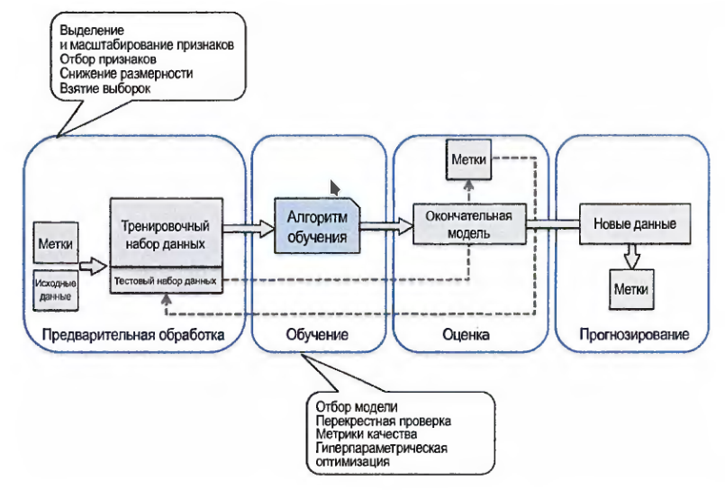
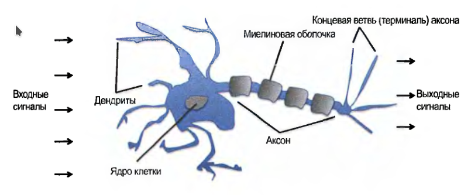
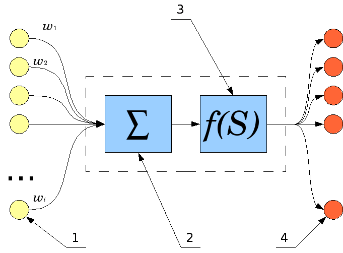
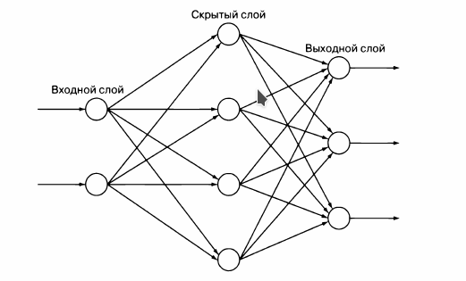
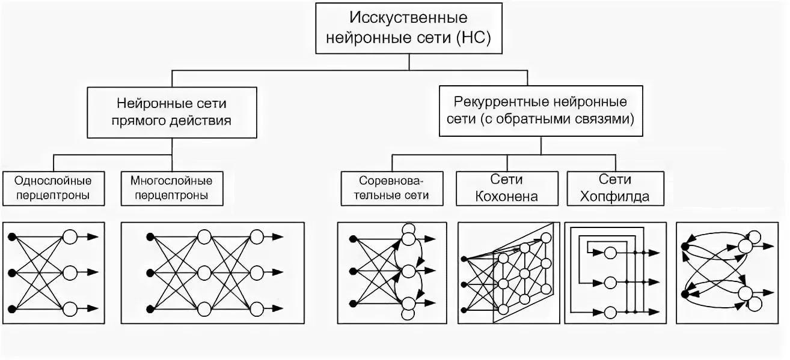
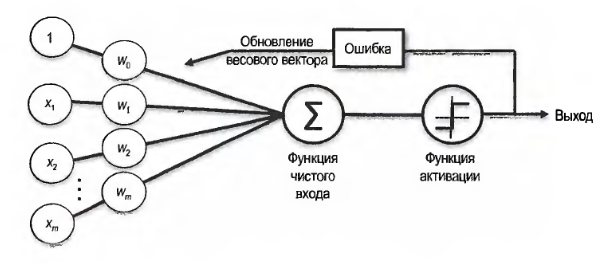
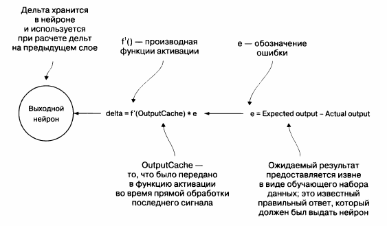
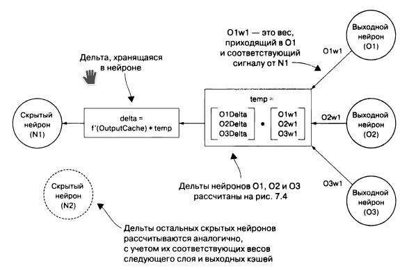
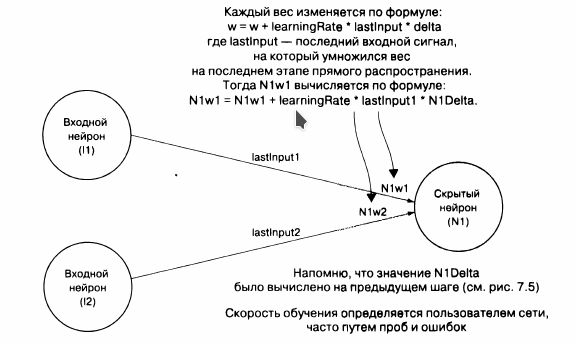
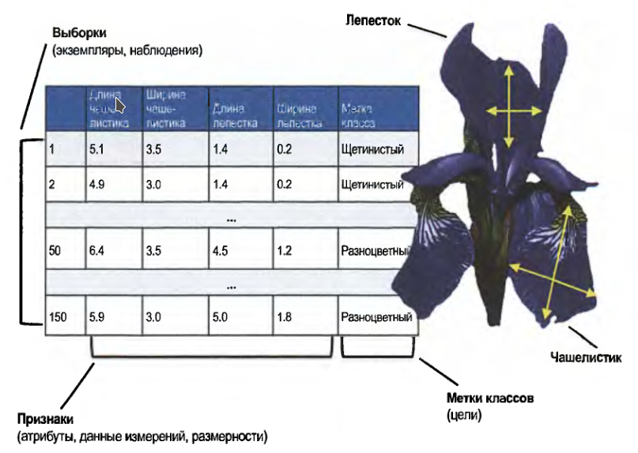

---
jupyter:
  jupytext:
    text_representation:
      extension: .md
      format_name: markdown
      format_version: '1.3'
      jupytext_version: 1.16.7
  kernelspec:
    display_name: Python 3 (ipykernel)
    language: python
    name: python3
---

<!-- #region slideshow={"slide_type": "slide"} toc=true editable=true -->
# Лекция 17: Введение в нейронные сети

МГТУ им. Н.Э. Баумана

Красников Александр Сергеевич

https://github.com/askras/bmstu_machinelearning/

2024-2025
<!-- #endregion -->

```python slideshow={"slide_type": "slide"} editable=true
import matplotlib.pyplot as plt
import numpy as np

%load_ext jupyter_tikz
```

<!-- #region slideshow={"slide_type": "slide"} editable=true -->
## Как "думает" компьютер

- машинное обучение
- нейронные сети
- глубокое обучение
<!-- #endregion -->

<!-- #region slideshow={"slide_type": "slide"} editable=true -->
## Диаграмма потока операций



Диаграмма потока операций при использовании машинного обучений в прогнозном моделировании
<!-- #endregion -->

<!-- #region slideshow={"slide_type": "slide"} editable=true -->
## Биологический нейрон

**Биологический нейрон** - электрически возбудимая клетка, которая предназначена для приема извне, обработки, хранения, передачи и вывода вовне информации с помощью электрических и химических сигналов. 

Типичный нейрон состоит из тела клетки, дендритов и одного аксона. Нейроны могут соединяться один с другим, формируя биологические нейронные сети. По отношению к границе нервной системы и направлению передачи информации нейроны разделяют на рецепторные (граничные, получают сигналы извне, формируют на их основании и передают информацию в нервную систему), эффекторные (граничные, передают сигналы из нервной системы во внешние клетки) и вставочные (внутренние для нервной системы). 



.
<!-- #endregion -->

<!-- #region slideshow={"slide_type": "slide"} editable=true -->
## Искусственный нейронa
**Искусственный нейрон** - узел искусственной нейронной сети, являющийся упрощённой моделью естественного биологического нейрона.



1. Нейроны, выходные сигналы которых поступают на вход данному
2. Сумматор входных сигналов
3. Вычислитель передаточной функции
4. Нейроны, на входы которых подаётся выходной сигнал данного
5. $\omega_i$ — веса входных сигналов
<!-- #endregion -->

<!-- #region slideshow={"slide_type": "slide"} editable=true -->
## Математическая модель искусственного нейрон

Математически нейрон представляет собой взвешенный сумматор, единственный выход которого определяется через его входы и матрицу весов следующим образом:

$$ y = f(u) + b,$$ где 
$$u= \sum\limits_{i=1}^{n} w_{i}x_{i}$$
$$b= w_{0}x_{0} $$

Здесь $x_{i}$ и $w_{i}$ — соответственно сигналы на входах нейрона и веса входов, функция $u$ называется индуцированным локальным полем, а $f(u)$ — передаточной функцией (функцией активации). 

Возможные значения сигналов на входах нейрона считают заданными в интервале $[ 0 , 1 ]$. Они могут быть либо дискретными (0 или 1), либо аналоговыми. 

Дополнительный вход $x_{0}$ и соответствующий ему вес $w_{0}$ используются для инициализации нейрона. 

Под инициализацией подразумевается смещение активационной функции нейрона по горизонтальной оси, то есть формирование порога чувствительности нейрона. 

Кроме того, иногда к выходу нейрона специально добавляют некую случайную величину, называемую сдвигом. Сдвиг можно рассматривать как сигнал на дополнительном, всегда нагруженном, синапсе.
<!-- #endregion -->

<!-- #region slideshow={"slide_type": "slide"} editable=true -->
### Функции активации

***Функция активации*** (***передаточная функция***)- определяет выходной сигнал, который определяется входным сигналом или набором входных сигналов.

В большинстве случаев она является монотонно возрастающей и имеет область значений $[ − 1 , 1 ]$  или $[ 0 , 1]$, однако существуют исключения. 

Для некоторых алгоритмов обучения сети необходимо, чтобы она была непрерывно дифференцируемой на всей числовой оси.

Искусственный нейрон полностью характеризуется своей передаточной функцией. Использование различных передаточных функций позволяет вносить нелинейность в работу нейрона и в целом нейронной сети.
<!-- #endregion -->

<!-- #region slideshow={"slide_type": "slide"} editable=true -->
### Основные типы передаточных функций
<!-- #endregion -->

```python editable=true slideshow={"slide_type": "subslide"}
def plot_transfer_function(u, y, title):
    """Отрисовывает график функции активации"""
    
    ax = plt.gca()
    ax.spines['left'].set_position('center')
    ax.spines['bottom'].set_position('center')
    ax.spines['top'].set_visible(False)
    ax.spines['right'].set_visible(False)
    ax.set_xlim([-1.5, 1.5])
    ax.set_ylim([-1.5, 1.5])

    plt.plot(u, y)
    plt.title(title)
    plt.show()
```

<!-- #region slideshow={"slide_type": "slide"} editable=true -->
#### Линейная передаточная функция

Сигнал на выходе нейрона линейно связан со взвешенной суммой сигналов на его входе.

$$f(u)=t \cdot u,$$
где $t$ — параметр функции. 

В искусственных нейронных сетях со слоистой структурой нейроны с передаточными функциями такого типа, как правило, составляют входной слой.

Кроме простой линейной функции, могут быть использованы её модификации, например, полулинейная функция (если её аргумент меньше нуля, то она равна нулю, а в остальных случаях ведет себя как линейная) или шаговая (линейная функция с насыщением), которую можно выразить формулой:
$$ f(u)={\begin{cases}0&{\text{если }}u\leq -b,\\1&{\text{если }}u\geq 1-b,\\u&{\text{в остальных случаях.}}\end{cases}}$$

При этом возможен сдвиг функции по обеим осям (как изображено на рисунке).

Недостатками шаговой и полулинейной активационных функций относительно линейной можно назвать то, что они не являются дифференцируемыми на всей числовой оси, а значит, не могут быть использованы при обучении по некоторым алгоритмам. 
<!-- #endregion -->

```python slideshow={"slide_type": "subslide"} editable=true
def linear_transfer_function(u, w0=0.5):
    """Линейная функция активации с насыщением"""

    b = w0 * 1
    y = np.array(u)+b
    y[u < -b] = 0
    y[u > 1-b] = 1
    return y

u = np.linspace(-1.5,1.5, 100)
y = linear_transfer_function(u, w0=0.5)
plot_transfer_function(u, y, "Линейная функция активации с насыщением")

```

<!-- #region slideshow={"slide_type": "slide"} editable=true -->
### Пороговая передаточная функция

Другое название — **функция Хевисайда**. Представляет собой перепад. До тех пор, пока взвешенный сигнал на входе нейрона не достигает некоторого уровня $T$, сигнал на выходе равен нулю. Как только сигнал на входе нейрона превышает указанный уровень — выходной сигнал скачкообразно изменяется на единицу. Самый первый представитель слоистых искусственных нейронных сетей — перцептрон состоял исключительно из нейронов такого типа. Математическая запись этой функции выглядит так:
$$f(u)={\begin{cases}1&{\text{если }}u\geq T,\\0 &{\text{в противном случае}}\end{cases}}$$

Здесь $T=-w_{0}x_{0}$ — сдвиг функции активации относительно горизонтальной оси, соответственно под u следует понимать взвешенную сумму сигналов на входах нейрона без учёта этого слагаемого. 
Ввиду того, что данная функция не является дифференцируемой на всей оси абсцисс, её нельзя использовать в сетях, обучающихся по алгоритму обратного распространения ошибки и другим алгоритмам, требующим дифференцируемости передаточной функции.
<!-- #endregion -->

```python slideshow={"slide_type": "subslide"} editable=true
def heaviside_step_function(u, w0=0):
    """Пороговая передаточная функция"""
    T = -w0 * 1
    y = np.array(u)
    y[u >= T] = 1
    y[u < T] = 0
    return y

u = np.linspace(-1.5,1.5, 1000)
y = heaviside_step_function(u, w0=0)
plot_transfer_function(u, y, "Пороговая передаточная функция")
```

<!-- #region slideshow={"slide_type": "slide"} editable=true -->
### Сигмоидальная передаточная функция

Один из самых часто используемых на данный момент типов передаточных функций.

$$\sigma (u)={\frac {1}{1+e^{-u}}}$$

Введение функций сигмоидального типа было обусловлено ограниченностью нейронных сетей с пороговой функцией активации нейронов — при такой функции активации любой из выходов сети равен либо нулю, либо единице, что ограничивает использование сетей не в задачах классификации. Использование сигмоидальных функций позволило перейти от бинарных выходов нейрона к аналоговым. Функции передачи такого типа, как правило, присущи нейронам, находящимся во внутренних слоях нейронной сети.
<!-- #endregion -->

<!-- #region slideshow={"slide_type": "slide"} editable=true -->
### Логистическая функция

Математически логистическую функцию можно выразить так:

$$\sigma (u)={\frac {1}{1+e^{-tu}}}$$

Здесь $t$ — это параметр функции, определяющий её крутизну. Когда $t$ стремится к бесконечности, функция вырождается в пороговую. При $t = 0$ сигмоида вырождается в постоянную функцию со значением $0,5$. Область значений данной функции находится в интервале (0,1). Важным достоинством этой функции является простота её производной:

$$\cfrac {d\sigma (u)}{du}
=t\sigma (u)(1-\sigma (u))$$

То, что производная этой функции может быть выражена через её значение, облегчает использование этой функции при обучении сети по алгоритму обратного распространения. Особенностью нейронов с такой передаточной характеристикой является то, что они усиливают сильные сигналы существенно меньше, чем слабые, поскольку области сильных сигналов соответствуют пологим участкам характеристики. Это позволяет предотвратить насыщение от больших сигналов
<!-- #endregion -->

<!-- #region slideshow={"slide_type": "slide"} editable=true -->
### Гиперболический тангенс

Использование функции гиперболического тангенса

$$th (Au)={\frac {e^{Au}-e^{-Au}}{e^{Au}+e^{-Au}}}$$

отличается от рассмотренной выше логистической кривой тем, что его область значений лежит в интервале (-1;1). Так как верно соотношение

$$th \left({\frac {t}{2}}u\right)=2\sigma (u)-1,$$

то оба графика различаются лишь масштабом осей. Производная гиперболического тангенса, разумеется, тоже выражается квадратичной функцией значения; свойство противостоять насыщению имеет место точно так же. 
<!-- #endregion -->

<!-- #region slideshow={"slide_type": "slide"} editable=true -->
### Модифицированный гиперболический тангенс

Использование функции модифицированного гиперболического тангенса

$$mth(u)={\frac {e^{u}-e^{-u}}{e^{au}+e^{-bu}}},(a,b>1),$$

масштабированной по оси ординат до интервала [-1;1] позволяет получить семейство сигмоидальных функций. 
<!-- #endregion -->

<!-- #region slideshow={"slide_type": "slide"} editable=true -->
## Моделирование формальных логических функций

Нейрон с пороговой передаточной функцией может моделировать различные логические функции.

$$f(u)=
\begin{cases}
  1 & \text{если } u \geq T, \\
  0 & \text{в противном случае,}
\end{cases}$$

где $$u=\sum _{i=1}^{n}w_{i}x_{i}+0$$

Таблицы иллюстрируют, каким образом можно, задав веса входных сигналов и порог чувствительности, заставить нейрон выполнять конъюнкцию (логическое «И») и дизъюнкцию (логическое «ИЛИ») над входными сигналами, а также логическое отрицание входного сигнала[19]. Этих трех операций достаточно, чтобы смоделировать абсолютно любую логическую функцию любого числа аргументов.
<!-- #endregion -->

```python slideshow={"slide_type": "slide"} editable=true
%%tikz

\begin{tikzpicture}[scale=9]

    % Вход
    \draw[-] (-1, 0.5) -- (0, 0.5) node[midway, above] {$x$};

    % Нейрон
    \draw[draw=black, fill=gray!20] (0, 0.5) circle (0.5) node {NOT};

    % Выход
    \draw[->] (0.5, 0.5) -- (1.5, 0.5) node[midway, above] {$y$};

    % Визуализация весов и смещения
    \node at (-0.7, 0.6) {$w = -1.5$};
    \node at (0.5, 0.8) {$T = -1$};

\end{tikzpicture}
```

```python slideshow={"slide_type": "slide"} editable=true
%%tikz

\begin{tikzpicture}[scale=9]

    % Входы
    \draw[-] (-1, 1) -- (0, 1) node[midway, above] {$x_1$};
    \draw[-] (-1, 0) -- (0, 0) node[midway, above] {$x_2$};

    % Нейрон
    \draw[draw=black, fill=gray!20] (0, 0.5) circle (0.5) node {AND};

    % Выход
    \draw[->] (0.5, 0.5) -- (1.5, 0.5) node[midway, above] {$y$};

    % Визуализация весов и смещения
    \node at (0, 1.2) {$w_1 = 1$};
    \node at (0, -0.2) {$w_2 = 1$};
    \node at (0.5, 0.8) {$T = 1.5$};

\end{tikzpicture}
```

```python slideshow={"slide_type": "slide"} editable=true
%%tikz

\begin{tikzpicture}[scale=9]

    % Входы
    \draw[-] (-1, 1) -- (0, 1) node[midway, above] {$x_1$};
    \draw[-] (-1, 0) -- (0, 0) node[midway, above] {$x_2$};

    % Нейрон
    \draw[draw=black, fill=gray!20] (0, 0.5) circle (0.5) node {OR};

    % Выход
    \draw[->] (0.5, 0.5) -- (1.5, 0.5) node[midway, above] {$y$};

    % Визуализация весов и смещения
    \node at (0, 1.2) {$w_1 = 1$};
    \node at (0, -0.2) {$w_2 = 1$};
    \node at (0.5, 0.8) {$T = 0.5$};

\end{tikzpicture}
```

<!-- #region slideshow={"slide_type": "slide"} editable=true -->
## Искусственные нейронные сети



Простая нейронная сеть с одним входным слоем, состоящим из двух нейронов, одним скрытым слоем из четырех нейронов и однмм выходным слоем из трех нейронов.
<!-- #endregion -->

<!-- #region slideshow={"slide_type": "slide"} editable=true -->
### Слои

- **входной слой** - первый слой, получает сиглалы от внешнего объекта

- **выходной слой** - последний слой, его выходные сигналы обычно должен интерпретировать внешний субъект

- **скрытые слои** - слои, расположенные между входным и выходным слоями

Заметим, что количество нейронов в каждом слое произвольно
<!-- #endregion -->

<!-- #region slideshow={"slide_type": "slide"} editable=true -->
### Виды искусственных нейронных сетей


<!-- #endregion -->

<!-- #region slideshow={"slide_type": "slide"} editable=true -->
## Сети прямой связи с обратным распространением


<!-- #endregion -->

<!-- #region slideshow={"slide_type": "slide"} editable=true -->
## Схема работы сети прямой связи с обратным распространением.



Механизм, с помощью которого вычисляется дельта выходного нейрона на этапе обучения посредством обратного распространения.
<!-- #endregion -->

<!-- #region slideshow={"slide_type": "slide"} editable=true -->


Вычисление дельты для нейронной сети в скрытом слое.
<!-- #endregion -->

<!-- #region slideshow={"slide_type": "slide"} editable=true -->


Веса каждого скрытого слоя и нейрона выходного слоя обновляются с использованием дельт, рассчитанных на предыдущих шагах, предыдущих весов, предыдущих входных данных и заданной пользователем скорости обучения.
<!-- #endregion -->

<!-- #region slideshow={"slide_type": "slide"} editable=true -->
### Сигмоидная функция активация

$ всегда возвращает значение в диапазоне $0..1$.")

Сигмоидная функция активация $S(x)$ всегда возвращает значение в диапазоне $0..1$.
<!-- #endregion -->

<!-- #region slideshow={"slide_type": "slide"} editable=true -->
# Реализация нейронной сети
<!-- #endregion -->

<!-- #region slideshow={"slide_type": "slide"} editable=true -->
## Немного математики

- **Вектор** - упорядоченная совокупность однородных элементов.

$$ x = (x_1, \; x_2, \; x_3) $$, $$ y = (y_1, \; y_2, \; y_3) $$ 

- **Скалярное произведение векторов** - операция над векторами не зависящая от системы координат и характеризующая длины векторов-сомножителей и угол между ними.

$$ x \cdot y = (x_1 \cdot y_1, \;\; x_2 \cdot y_2, \;\; x_3 \cdot y_3) $$ 
<!-- #endregion -->

```python slideshow={"slide_type": "slide"} editable=true
from math import exp
from typing import List


from matplotlib import pyplot as plt
from pandas import DataFrame
from sklearn import datasets

import seaborn as sns


%matplotlib inline
```

<!-- #region slideshow={"slide_type": "slide"} editable=true -->
## Вспомогательные функции
<!-- #endregion -->

<!-- #region slideshow={"slide_type": "slide"} editable=true -->
### Скалярное произведение векторов
<!-- #endregion -->

```python slideshow={"slide_type": "subslide"} editable=true
# скалярное произведение двух векторов
def dot_product(xs: List[float], ys: List[float]) -> float:
    return sum(x * y for x, y in zip(xs, ys))
```

```python slideshow={"slide_type": "subslide"} editable=true
a = [-1, 2, 3]
b = [10, 20, 30] 

dot_product(a, b)
```

<!-- #region slideshow={"slide_type": "slide"} editable=true -->
### Классическая сигмоидная функция активации
<!-- #endregion -->

```python slideshow={"slide_type": "subslide"} editable=true
# классическая сигмоидная функция активации
def sigmoid(x: float) -> float:
    return 1.0 / (1.0 + exp(-x))
```

```python slideshow={"slide_type": "subslide"} editable=true
sigmoid_table = {x: sigmoid(x) for x in range(-10, 11)}

for x, y in sigmoid_table.items():
    print(f"x = {x:3}     y={y:.6f}")
```

```python slideshow={"slide_type": "subslide"} editable=true
plt.figure(figsize=(9, 6), dpi=75)
plt.plot(sigmoid_table.keys(), sigmoid_table.values(), 'r')

ax = plt.gca()
ax.spines['right'].set_color('none')
ax.spines['top'].set_color('none')

ax.xaxis.set_ticks_position('bottom')
ax.spines['bottom'].set_position(('data',0))
ax.yaxis.set_ticks_position('left')
ax.spines['left'].set_position(('data',0))

plt.show()
```

<!-- #region slideshow={"slide_type": "slide"} editable=true -->
### Производная сигмоидной функции активации
<!-- #endregion -->

```python slideshow={"slide_type": "subslide"} editable=true
# Производная сигмоидной функции активации
def derivative_sigmoid(x: float) -> float:
    sig: float = sigmoid(x)
    return sig * (1 - sig)    
```

```python slideshow={"slide_type": "subslide"} editable=true
derivative_sigmoid_table = {x: derivative_sigmoid(x) for x in range(-10, 11)}

for x, y in derivative_sigmoid_table.items():
    print(f"x = {x:3}     y={y:.3f}")
```

```python slideshow={"slide_type": "subslide"} editable=true
plt.figure(figsize=(9, 6), dpi=75)
plt.plot(derivative_sigmoid_table.keys(), derivative_sigmoid_table.values(), 'r')


ax = plt.gca()
ax.spines['right'].set_color('none')
ax.spines['top'].set_color('none')

ax.xaxis.set_ticks_position('bottom')
ax.spines['bottom'].set_position(('data',0))
ax.yaxis.set_ticks_position('left')
ax.spines['left'].set_position(('data',0))

plt.show()
```

<!-- #region slideshow={"slide_type": "slide"} editable=true -->
### Нормализация значений
<!-- #endregion -->

<!-- #region slideshow={"slide_type": "subslide"} editable=true -->
$$ \overline{x}_i = \cfrac{x_i - \min(x)}{\max(x) - \min(x)} $$

$$ 0 \leq  \overline{x}_i \leq 1 $$
<!-- #endregion -->

```python slideshow={"slide_type": "subslide"} editable=true
# Нормализация значений
def normalize_by_feature_scaling(dataset: List[List[float]]) -> None:
    for col_num in range(len(dataset[0])):
        column: List[float] = [row[col_num] for row in dataset]
        maximum = max(column)
        minimum = min(column)
        for row_num in range(len(dataset)):
            dataset[row_num][col_num] = (dataset[row_num][col_num] - minimum) / (maximum - minimum)
```

```python slideshow={"slide_type": "subslide"} editable=true
data = [[1, 2, 3], 
        [10, 20, 30],
        [23, 93, 20],
        [24, 78, 91]
]


fig = plt.figure()


for col_num in range(len(data[0])):
        index: int = range(col_num * len(data), (col_num + 1) * len(data))
        values: List[float] = [row[col_num] for row in data]
        fig.add_subplot(1, len(data[0]), col_num+1).bar(index, values, color=['red'])


normalize_by_feature_scaling(data)
for col_num in range(len(data[0])):
        index: int = range(col_num * len(data), (col_num + 1) * len(data))
        values: List[float] = [row[col_num] for row in data]
        fig.add_subplot(2, len(data[0]), col_num+1).bar(index, values, color=['black'])

        
plt.show()

data
```

<!-- #region slideshow={"slide_type": "slide"} editable=true -->
# Построение сети
<!-- #endregion -->

<!-- #region slideshow={"slide_type": "slide"} editable=true -->
## Реализация нейронов
<!-- #endregion -->

```python slideshow={"slide_type": "subslide"} editable=true
from typing import List, Callable

class Neuron:
    def __init__(
        self, 
        weights: List[float], 
        learning_rate: float, 
        activation_function: Callable[[float], float], 
        derivative_activation_function: Callable[[float], float]
    ) -> None:
        self.weights: List[float] = weights
        self.activation_function: Callable[[float], float] = activation_function
        self.derivative_activation_function: Callable[[float], float] = derivative_activation_function
        self.learning_rate: float = learning_rate
        self.output_cache: float = 0.0
        self.delta: float = 0.0

    def output(self, inputs: List[float]) -> float:
        self.output_cache = dot_product(inputs, self.weights)
        return self.activation_function(self.output_cache)
```

<!-- #region slideshow={"slide_type": "slide"} -->
## Реализация слоев
<!-- #endregion -->

```python slideshow={"slide_type": "subslide"} editable=true
from __future__ import annotations
from typing import List, Callable, Optional
from random import random

class Layer:
    def __init__(self, previous_layer: Optional[Layer], num_neurons: int, learning_rate: float, activation_function: Callable[[float], float], derivative_activation_function: Callable[[float], float]) -> None:
        self.previous_layer: Optional[Layer] = previous_layer
        self.neurons: List[Neuron] = []
        for i in range(num_neurons):
            if previous_layer is None:
                random_weights: List[float] = []
            else:
                random_weights = [random() for _ in range(len(previous_layer.neurons))]
            neuron: Neuron = Neuron(random_weights, learning_rate, activation_function, derivative_activation_function)
            self.neurons.append(neuron)
        self.output_cache: List[float] = [0.0 for _ in range(num_neurons)]

    def outputs(self, inputs: List[float]) -> List[float]:
        if self.previous_layer is None:
            self.output_cache = inputs
        else:
            self.output_cache = [n.output(inputs) for n in self.neurons]
        return self.output_cache

    # Вызывается только для выходного слоя
    def calculate_deltas_for_output_layer(self, expected: List[float]) -> None:
        for n in range(len(self.neurons)):
            self.neurons[n].delta = self.neurons[n].derivative_activation_function(self.neurons[n].output_cache) * (expected[n] - self.output_cache[n])

    # не вызывается для выходного слоя
    def calculate_deltas_for_hidden_layer(self, next_layer: Layer) -> None:
        for index, neuron in enumerate(self.neurons):
            next_weights: List[float] = [n.weights[index] for n in next_layer.neurons]
            next_deltas: List[float] = [n.delta for n in next_layer.neurons]
            sum_weights_and_deltas: float = dot_product(next_weights, next_deltas)
            neuron.delta = neuron.derivative_activation_function(neuron.output_cache) * sum_weights_and_deltas
```

<!-- #region slideshow={"slide_type": "slide"} -->
## Реализация сети
<!-- #endregion -->

```python slideshow={"slide_type": "subslide"} editable=true
from __future__ import annotations
from typing import List, Callable, TypeVar, Tuple
from functools import reduce

#from layer import Layer
#from util import sigmoid, derivative_sigmoid

T = TypeVar('T') # тип выходных данных в интерпретации сети


class Network:
    def __init__(self, layer_structure: List[int], learning_rate: float, activation_function: Callable[[float], float] = sigmoid, derivative_activation_function: Callable[[float], float] = derivative_sigmoid) -> None:
        if len(layer_structure) < 3:
            raise ValueError("Ошибка: Добжно быть не менее 3 слоев (1 вход , 1 скрытый, 1 выход)")
        self.layers: List[Layer] = []
        # входной слой
        input_layer: Layer = Layer(None, layer_structure[0], learning_rate, activation_function, derivative_activation_function)
        self.layers.append(input_layer)
        # скрытые и выходной слой
        for previous, num_neurons in enumerate(layer_structure[1::]):
            next_layer = Layer(self.layers[previous], num_neurons, learning_rate, activation_function, derivative_activation_function)
            self.layers.append(next_layer)

    # Помещает входные данные на первый слой, затем выводит их
    # с первого слоя и подает на второй слой в качестве входных данных
    # со второгоа - на третий и т.д.
    def outputs(self, input: List[float]) -> List[float]:
        return reduce(lambda inputs, layer: layer.outputs(inputs), self.layers, input)

    # Определяет изменение каждого нейрона на основании ошибок
    # выходных данных по сравнению с ожидаемым результатом
    def backpropagate(self, expected: List[float]) -> None:
        # calculate delta for output layer neurons
        last_layer: int = len(self.layers) - 1
        self.layers[last_layer].calculate_deltas_for_output_layer(expected)
        # вычисление дельты для скрытых слоев в обратном порядке
        for l in range(last_layer - 1, 0, -1):
            self.layers[l].calculate_deltas_for_hidden_layer(self.layers[l + 1])

    # Использует дельты, вычисленные в backpropagate(),
    # чтобы изменить веса
    def update_weights(self) -> None:
        for layer in self.layers[1:]: # skip input layer
            for neuron in layer.neurons:
                for w in range(len(neuron.weights)):
                    neuron.weights[w] = neuron.weights[w] + (neuron.learning_rate * (layer.previous_layer.output_cache[w]) * neuron.delta)

    # Функция train() использует результаты выполнения функции outputs()
    # для нескольких входных данных, сравнивает их с ожидаемым
    # результатом и передает полученное значение в
    #backpropagate() и update_weights()
    def train(self, inputs: List[List[float]], expecteds: List[List[float]]) -> None:
        for location, xs in enumerate(inputs):
            ys: List[float] = expecteds[location]
            outs: List[float] = self.outputs(xs)
            self.backpropagate(ys)
            self.update_weights()

    # Для параметризованных результатов, которые требуют классификации,
    # возвращает правильное количество попыток и процентное
    # онтошение по сравнению с общим количеством
    def validate(self, inputs: List[List[float]], expecteds: List[T], interpret_output: Callable[[List[float]], T]) -> Tuple[int, int, float]:
        correct: int = 0
        for input, expected in zip(inputs, expecteds):
            result: T = interpret_output(self.outputs(input))
            is_correct = False
            if result == expected:
                correct += 1
                is_correct = True
            print(f'Ожидается: {expected:17} Получено: {result:17} {is_correct}!')
        percentage: float = correct / len(inputs)
        return correct, len(inputs), percentage
```

<!-- #region slideshow={"slide_type": "slide"} -->
# Пример задачи классификации (Ирисы Фишера)

Ирис щетинистый | Ирис виргинский | Ирис разноцветный
:--------:|:-----:|:-------:
Iris setosa| Iris virginica| Iris versicolor
  |    |  


<!-- #endregion -->

<!-- #region slideshow={"slide_type": "slide"} -->
## Структура набора данных ирисов



Набор данных Ирисы Фишера https://ru.wikipedia.org/wiki/Ирисы_Фишера


sepal length - длина чашелистиков

sepal width - ширина чашелистиков

petal length - длина лепестка

petal width - ширина лепестка

<!-- #endregion -->

<!-- #region slideshow={"slide_type": "slide"} -->
### Визуализация данных

Немного отступим от правил. Воспользуемся библиотеками sklearn, pandas, seaborn для визуализации данных:
<!-- #endregion -->

```python slideshow={"slide_type": "subslide"}
# Загружаем набор данных Ирисы:
iris = datasets.load_iris()


iris_frame = DataFrame(iris.data)
# Делаем имена колонок такие же, как имена переменных:
iris_frame.columns = iris.feature_names
# Добавляем столбец с целевой переменной: 
iris_frame['target'] = iris.target
# Для наглядности добавляем столбец с сортами: 
iris_frame['name'] = iris_frame.target.apply(lambda x : iris.target_names[x])


sns.pairplot(iris_frame[['sepal length (cm)','sepal width (cm)','petal length (cm)','petal width (cm)','name']], hue = 'name')


```

<!-- #region slideshow={"slide_type": "subslide"} -->
# Классификация ирисов
<!-- #endregion -->

```python slideshow={"slide_type": "subslide"} editable=true
import csv
from typing import List
from random import shuffle

#from util import normalize_by_feature_scaling
#from network import Network

if __name__ == "__main__":
    iris_parameters: List[List[float]] = []
    iris_classifications: List[List[float]] = []
    iris_species: List[str] = []
        
    with open('./data/iris.csv', mode='r') as iris_file:
        irises: List = list(csv.reader(iris_file))
        shuffle(irises) 
        for iris in irises:
            parameters: List[float] = [float(n) for n in iris[0:4]]
            iris_parameters.append(parameters)
            species: str = iris[4]
            if species == "Iris-setosa":
                iris_classifications.append([1.0, 0.0, 0.0])
            elif species == "Iris-versicolor":
                iris_classifications.append([0.0, 1.0, 0.0])
            else:
                iris_classifications.append([0.0, 0.0, 1.0])
            iris_species.append(species)
    normalize_by_feature_scaling(iris_parameters)

    iris_network: Network = Network([4, 10, 3], 0.3)

    def iris_interpret_output(output: List[float]) -> str:  
        if max(output) == output[0]:
            return "Iris-setosa"
        elif max(output) == output[1]:
            return "Iris-versicolor"
        else:
            return "Iris-virginica"

    # Первые 140 ирисов из набора данных для обучения сети
    iris_trainers: List[List[float]] = iris_parameters[0:140]
    iris_trainers_corrects: List[List[float]] = iris_classifications[0:140]
    # Тест на последних десяти ирисах из набора данных
    iris_testers: List[List[float]] = iris_parameters[140:150]
    iris_testers_corrects: List[str] = iris_species[140:150]   
    
    # 50 циклов обучения 
    for _ in range(50):
        iris_network.train(iris_trainers, iris_trainers_corrects)
        #iris_results = iris_network.validate(iris_testers, iris_testers_corrects, iris_interpret_output)
        #print(f"\n{_}. Правильно {iris_results[0]} из {iris_results[1]} ({iris_results[2] * 100}%)")
            

    iris_results = iris_network.validate(iris_testers, iris_testers_corrects, iris_interpret_output)
        
    print(f"\nПравильно {iris_results[0]} из {iris_results[1]} ({iris_results[2] * 100}%)")
```

<!-- #region slideshow={"slide_type": ""} editable=true -->
# Повышение скорости работы сети

- использование библиотек с поддержкой SIMD (single instruction, multiple data) (NumPy, Pandas)

- использование библиотек нейронных сетей (TensorFlow, PyTorch)

- использование вычислений на GPU


<!-- #endregion -->

<!-- #region slideshow={"slide_type": "slide"} -->
# Проблемы и расширения нейронных сетей

- Нейронная сеть - черный ящик. Трудно или невозможно анализировать влияние конкретных входных параметров на результат

- Необходимость больших обучающих наборов 

- Дороговизна с вычислительной точки зрения

- Сложность подбора параметров сети
<!-- #endregion -->

<!-- #region slideshow={"slide_type": "slide"} -->
# Реальные приложения

- Распознавание изображений (Facebook, Google, ...)

- Распознование голоса (Siri, Alexa, Cortana, Алиса, ...)

- Рекомендательные системы (YouTube, NetFlix, )

- Извлечение данных из текста (Twiter, Google, Yandex, ...)

- Генерация изображений

- Медицина 
<!-- #endregion -->

<!-- #region slideshow={"slide_type": "slide"} editable=true -->
# Упражения

1. Применить разработанную нейронную сеть для классификации элементов из другого набора данных

2. Создать обобщенную функцию parse_CSV() с параметрами, достаточно гибки ми для того, чтобы она могла заменить оба примера синтаксического анализа данных в формате CSV.

3. Запустить примеры с другой функцией активации. Исследовать как изменение функции активации влияет на точность сети? 

4. Переписать классы Network, Layer и Neuron с помощью  NumPy, чтобы ускорить работу нейронной сети.

5. Проработать заново решения примеров, используя популярную инфраструктуру нейронных сетей, такую как TensorFlow или PyTorch.
<!-- #endregion -->

```python editable=true slideshow={"slide_type": ""}

```
