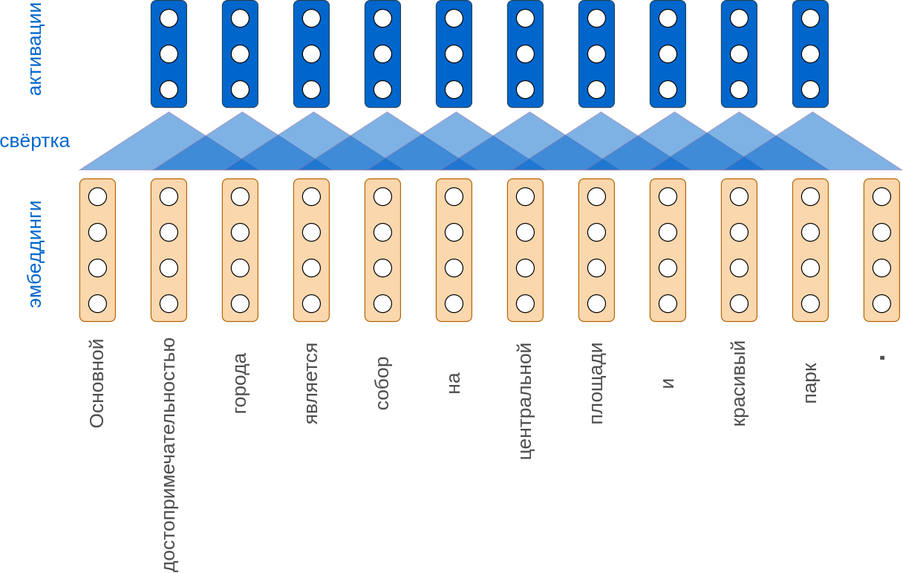
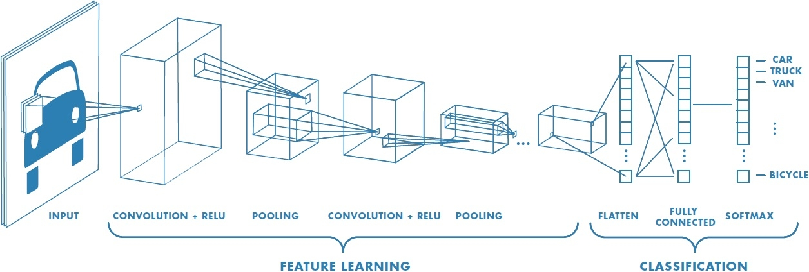
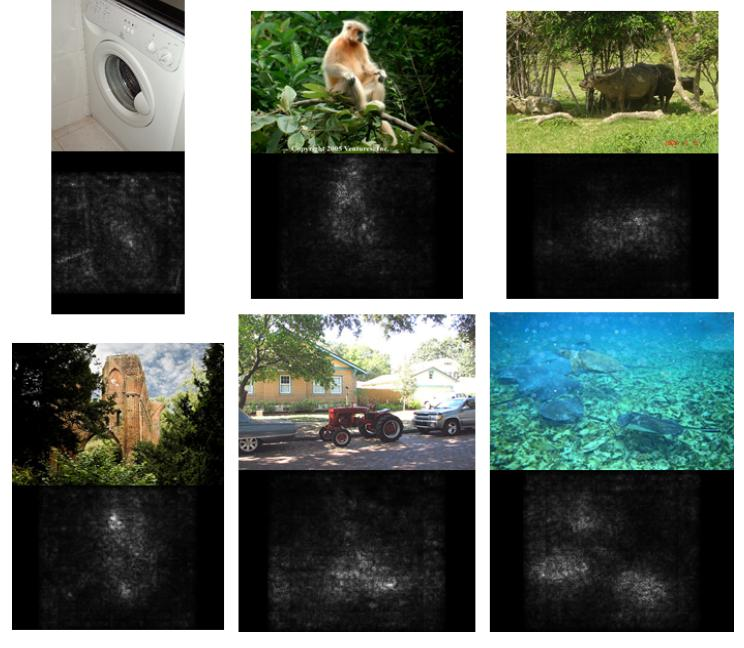
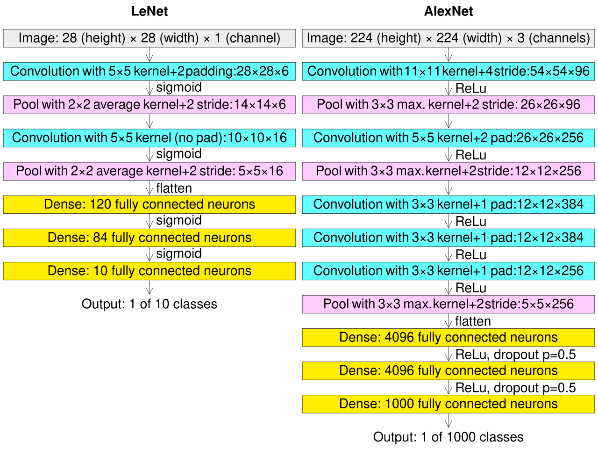
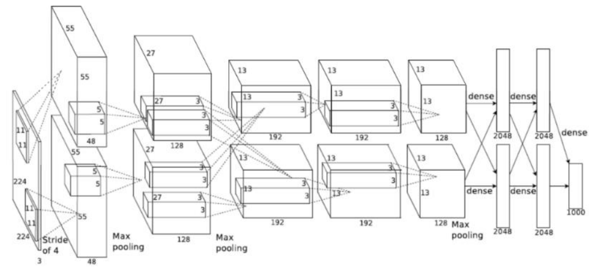
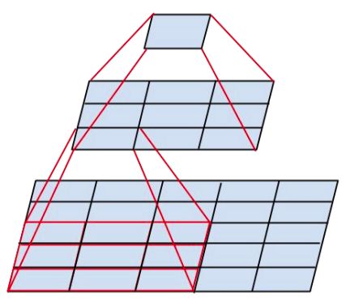
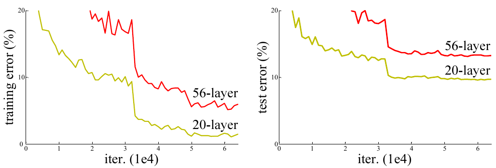
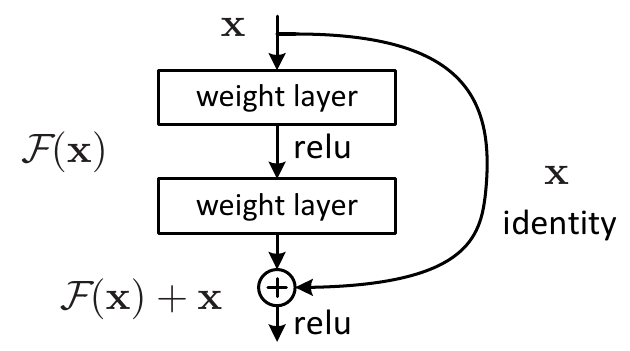
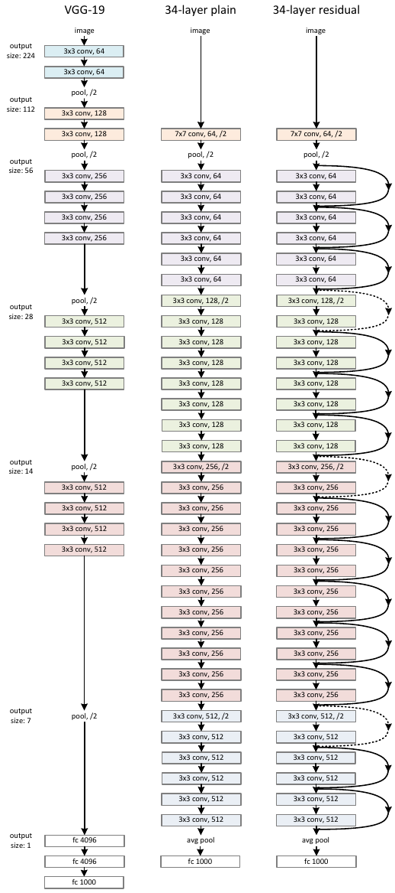
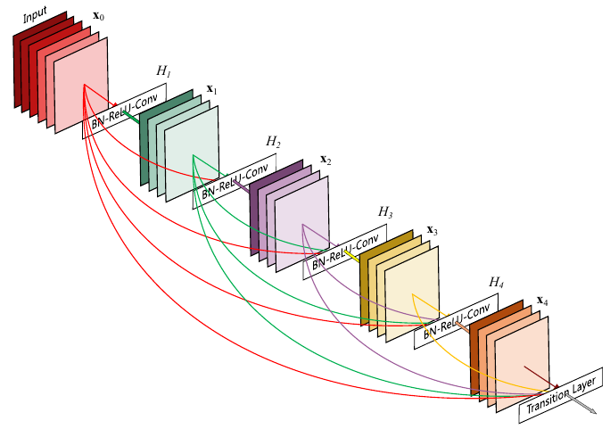

---
jupyter:
  jupytext:
    text_representation:
      extension: .md
      format_name: markdown
      format_version: '1.3'
      jupytext_version: 1.16.7
  kernelspec:
    display_name: Python 3 (ipykernel)
    language: python
    name: python3
---

<!-- #region editable=true slideshow={"slide_type": "slide"} toc=true -->
# Лекция 20: Сверточные нейронные сети

МГТУ им. Н.Э. Баумана

Красников Александр Сергеевич

https://github.com/askras/bmstu_machinelearning/

2024-2025
<!-- #endregion -->

<!-- #region editable=true slideshow={"slide_type": "slide"} -->
### Особенности CNN
- Большая часть вычислений сосредоточена в свёрточных слоях.
- Большая часть параметров находится в многослойном персептроне.
- Для предотвращения переобучения используется регуляризация, например, дроп-аут.
<!-- #endregion -->

<!-- #region editable=true slideshow={"slide_type": "slide"} -->
## Свёрточные сети для текста

Свёрточные сети используются для обработки текстов и других последовательностей. Каждое слово кодируется эмбеддингом — вектором фиксированного размера.

Рассмотрим предложение:
> Основной достопримечательностью города является собор на центральной площади и красивый парк.

- Каждое слово кодируется 4-мерным эмбеддингом.
- Применяются 3 свёртки с размером ядра 3.

<!-- #endregion -->

<!-- #region editable=true slideshow={"slide_type": "slide"} -->
## Свёрточные сети для изображений

Типичная архитектура CNN для классификации изображений включает:
- **Свёрточные слои** с нелинейностями.
- **Пулинги** для снижения пространственного разрешения.
- **Многослойный персептрон** для финальной классификации.

<!-- #endregion -->

<!-- #region editable=true slideshow={"slide_type": "slide"} -->
### Свёрточные сети для  аудио
CNN также применяется для обработки звуков, таких как человеческая речь. В этом случае используется мел-спектрограмма, где:
- Ось X — время.
- Ось Y — сила представленности частот.
<!-- #endregion -->

<!-- #region editable=true slideshow={"slide_type": "slide"} -->

<!-- #endregion -->

<!-- #region editable=true slideshow={"slide_type": "slide"} -->

<!-- #endregion -->

<!-- #region editable=true slideshow={"slide_type": "slide"} -->

<!-- #endregion -->

<!-- #region editable=true slideshow={"slide_type": "slide"} -->

<!-- #endregion -->

<!-- #region editable=true slideshow={"slide_type": "slide"} -->

<!-- #endregion -->

<!-- #region editable=true slideshow={"slide_type": "slide"} -->

<!-- #endregion -->

<!-- #region editable=true slideshow={"slide_type": "slide"} -->

<!-- #endregion -->

<!-- #region editable=true slideshow={"slide_type": ""} -->
## Интерпретация прогнозов в CNN

### Методы визуализации
<!-- #endregion -->

<!-- #region editable=true slideshow={"slide_type": ""} -->
#### Анализ закрасок (Occlusion Analysis)
- Закрашивание участков изображения и анализ изменения вероятности класса
- Карта показывает важные регионы для классификации  

<!-- #endregion -->

<!-- #region editable=true slideshow={"slide_type": ""} -->
#### Градиентные методы
**Карта выраженности (Saliency Map):**
- Вычисление градиентов по пикселям:  
$$W = \frac{\partial g_c(\mathbf{x})}{\partial \mathbf{x}}$$
- Максимизация градиентов по цветовым каналам  

**Grad-CAM:**
- Анализ градиентов последнего сверточного слоя
- Формула значимости каналов:  
$$\alpha^c_k = \frac{1}{hw}\sum_{i,j} \frac{\partial g_c}{\partial A^k_{ij}}$$  

<!-- #endregion -->

<!-- #region editable=true slideshow={"slide_type": ""} -->
##### Визуализация характерных изображений
- Оптимизация входного изображения для максимизации класса:  
$$\hat{\mathbf{x}}_c = \arg\max_\mathbf{x} \{ g_c(\mathbf{x})-\lambda \|\mathbf{x}\|^2_2\}$$  

<!-- #endregion -->

<!-- #region editable=true slideshow={"slide_type": ""} -->
#### Другие подходы
- Визуализация рецептивных полей сверток
- Декодирование активаций (Deconv Net)  

<!-- #endregion -->

<!-- #region editable=true slideshow={"slide_type": ""} -->
### Преимущества методов
- Объяснение решений модели
- Выявление ошибок в данных
- Понимание семантики слоев CNN
<!-- #endregion -->

<!-- #region editable=true slideshow={"slide_type": "slide"} -->
## Основные свёрточные архитектуры
<!-- #endregion -->

<!-- #region editable=true slideshow={"slide_type": "slide"} -->
### Датасет ImageNet

- **ImageNet** — крупнейшая база данных для классификации и локализации изображений.
- Более **14 миллионов изображений** с классами и координатами объектов.
- Классы организованы по семантической сети **WordNet**.
<!-- #endregion -->

<!-- #region editable=true slideshow={"slide_type": "slide"} -->
## ILSVRC (ImageNet Large Scale Visual Recognition Challenge)
- Соревнование с 2010 года.
- Задача: классификация на **1000 классов**.
- Оценка по **top-5 точности** (правильный класс среди 5 наиболее вероятных).
<!-- #endregion -->

<!-- #region editable=true slideshow={"slide_type": "slide"} -->
### Точность моделей
- С 2015 года модели превзошли человеческую точность (**5.1%**).
<!-- #endregion -->

<!-- #region editable=true slideshow={"slide_type": "slide"} -->
### Развитие глубоких нейросетей
- Рост точности благодаря:
  - Мощным вычислителям (видеокарты).
  - Архитектурным инновациям и методам регуляризации.
- Увеличение числа слоёв в сетях-победителях.
<!-- #endregion -->

<!-- #region editable=true slideshow={"slide_type": "slide"} -->
## Архитектуры-победители
- **AlexNet и ZFNet**
- **VGG**
- **GoogleNet**
- **ResNet**
- Усовершенствования для работы на мобильных устройствах.
<!-- #endregion -->

<!-- #region editable=true slideshow={"slide_type": "slide"} -->
### Архитектура LeNet

#### Основные характеристики
- **Первая успешная свёрточная сеть** (разработана в 1998 г.)
- Предназначена для распознавания рукописных цифр (32x32 пикселя)
- Всего **~10,000 параметров**
- Сочетает свёртки, пулинг и полносвязные слои
<!-- #endregion -->

<!-- #region editable=true slideshow={"slide_type": "slide"} -->
#### Структура LeNet-5

1. **Свёрточные слои** (Convolutions):
   - Извлечение локальных признаков
   - Использование ядер 5x5

2. **Субдискретизация** (Subsampling):
   - Усредняющий пулинг 2x2
   - Постепенное уменьшение размерности

3. **Полносвязные слои**:
   - Классификация извлечённых признаков
   - Выходной слой с 10 нейронами (для цифр 0-9)
<!-- #endregion -->

<!-- #region editable=true slideshow={"slide_type": "slide"} -->
#### Историческое значение
- Пионерская архитектура для задач CV
- Доказала эффективность:
  - Иерархического обучения признаков
  - Обратного распространения для свёрточных сетей
- Использовалась в банковских системах для обработки чеков
<!-- #endregion -->

<!-- #region editable=true slideshow={"slide_type": "slide"} -->
### Ограничения
- Рассчитана на низкое разрешение изображений
- Мелкая архитектура (5 слоёв)
- Отсутствие современных техник:
  - ReLU активации
  - Dropout регуляризации
<!-- #endregion -->

<!-- #region editable=true slideshow={"slide_type": "slide"} -->
### Модели AlexNet и ZFNet

- **AlexNet** (2012) и **ZFNet** (2013) — ключевые архитектуры в истории свёрточных нейросетей.
- Победы в ILSVRC:
  - AlexNet: ошибка 15.3% (в 2 раза лучше предыдущих моделей).
  - ZFNet: улучшенная версия AlexNet.
- Старт "эры глубокого обучения".
<!-- #endregion -->

<!-- #region editable=true slideshow={"slide_type": "slide"} -->
#### AlexNet: Архитектура

- **8 слоёв**: 5 свёрточных + 3 полносвязных.
- **Особенности**:
  - Использование **ReLU** вместо tanh.
  - Максимальный пулинг (MaxPooling).
  - Параллельная обработка на двух GPU (групповые свёртки).
<!-- #endregion -->

<!-- #region editable=true slideshow={"slide_type": "slide"} -->
#### AlexNet: Инженерные улучшения

- Регуляризация: **Dropout** (50%) + **L2**.
- Аугментация данных: случайные кадрирования, отражения.
- Обучение на GPU (NVIDIA GTX 580, 3 ГБ).
<!-- #endregion -->

<!-- #region editable=true slideshow={"slide_type": "slide"} -->
#### ZFNet: Основные отличия

- Модификации AlexNet:
  - Уменьшение ядер первого слоя: **7×7** (вместо 11×11).
  - Увеличение числа фильтров в промежуточных слоях.
  - Визуализация активаций для анализа работы сети (*DeconvNet*).
<!-- #endregion -->

<!-- #region editable=true slideshow={"slide_type": "slide"} -->
#### Сравнение моделей

| **Параметр**       | AlexNet             | ZFNet               |
|---------------------|---------------------|---------------------|
| Первый слой         | 11×11, stride 4     | 7×7, stride 2       |
| Второй слой         | 5×5, stride 1       | 5×5, stride 2       |
| Количество параметров | ~60 млн           | ~60 млн (оптимизировано) |
| Основной вклад      | Внедрение глубоких сетей | Интерпретируемость |
<!-- #endregion -->

<!-- #region editable=true slideshow={"slide_type": "slide"} -->
#### Выводы
- **AlexNet**:
  - Первая успешная глубокая CNN.
  - Стандарт для последующих архитектур.
- **ZFNet**:
  - Улучшение интерпретируемости CNN.
  - Доказательство важности анализа активаций.
- Наследие: основа для VGG, ResNet, EfficientNet.
<!-- #endregion -->

<!-- #region editable=true slideshow={"slide_type": "slide"} -->
### VGG

- **VGG** (2014) — одна из ключевых архитектур в истории CNN.
- Основные версии: **VGG-16** и **VGG-19** (16 и 19 слоёв).
- Не победитель ILSVRC 2014, но эталон для последующих моделей.
- Основной вклад: стандартизация использования **малых свёрточных ядер** (3×3).
<!-- #endregion -->

<!-- #region editable=true slideshow={"slide_type": "slide"} -->
#### Архитектура VGG

- **Структура**:
  - Каскад свёрточных слоёв (3×3) + MaxPooling (2×2).
  - 3 полносвязных слоя в конце.
- Глубина сети: 
  - VGG-16: 13 свёрточных + 3 полносвязных.
  - VGG-19: 16 свёрточных + 3 полносвязных.

<!-- #endregion -->

<!-- #region editable=true slideshow={"slide_type": "slide"} -->
#### Ключевая инновация: каскад из свёрток 3×3

- Замена больших ядер (5×5, 7×7) на **последовательность малых**:
  - 2 свёртки 3×3 ≈ 1 свёртка 5×5.
  - 3 свёртки 3×3 ≈ 1 свёртка 7×7.
- **Преимущества**:
  - Снижение числа параметров (на 28% для 5×5 → 2×3×3).
  - Увеличение нелинейности (ReLU после каждой свёртки).

<!-- #endregion -->

<!-- #region editable=true slideshow={"slide_type": "slide"} -->
#### Преимущества и наследие
- **Эффективность**:
  - Постепенное уменьшение пространственного разрешения.
  - Оптимизация вычислений за счёт малых ядер.
- **Применение**:
  - Базовый блок для переноса обучения (feature extraction).
  - Влияние на ResNet, DenseNet, EfficientNet.
- **Ограничения**:
  - 138 млн параметров (большинство — в полносвязных слоях).
  - Высокие вычислительные затраты.
<!-- #endregion -->

<!-- #region editable=true slideshow={"slide_type": "slide"} -->
### GoogLeNet

- **GoogLeNet** (2014) — победитель ILSVRC с топ-5 ошибкой ~7%.
- Основная идея: обработка объектов **разных масштабов** через параллельные свёртки.
- Ключевой элемент: **Inception-блоки** для многоуровневого анализа признаков.
<!-- #endregion -->

<!-- #region editable=true slideshow={"slide_type": "slide"} -->
#### Архитектура Inception

- **Параллельные операции** в блоке:
  - Свёртки 1×1, 3×3, 5×5
  - Максимальный пулинг 3×3
- **Bottleneck-свёртки 1×1**:
  - Снижение числа каналов перед крупными свёртками
  - Уменьшение вычислительных затрат на 30-40%

<!-- #endregion -->

<!-- #region editable=true slideshow={"slide_type": "slide"} -->
#### Полная архитектура

- **22 слоя** (9 Inception-блоков)
- Особенности:
  - Глобальный усредняющий пулинг вместо полносвязных слоёв
  - Всего **6.8 млн параметров** (в 10 раз меньше VGG-16)
  - Вспомогательные классификаторы (softmax0, softmax1) при обучении

<!-- #endregion -->

<!-- #region editable=true slideshow={"slide_type": "slide"} -->
#### Сравнение с VGG
| **Параметр**       | GoogLeNet         | VGG-16            |
|---------------------|-------------------|-------------------|
| Число слоёв         | 22                | 16                |
| Параметры           | 6.8 млн           | 138 млн           |
| Топ-5 ошибка (ILSVRC)| 6.7%             | 7.3%              |
| Скорость работы     | Медленнее         | Быстрее           |
<!-- #endregion -->

<!-- #region editable=true slideshow={"slide_type": "slide"} -->
## Объяснение прогнозов (CAM)

- **Class Activation Mapping**:
  - Выделение значимых областей для класса
  - Формула: $\sum(w_k^c * A_k)$, где:
    - $w_k^c$ — веса полносвязного слоя
    - $A_k$ — активации последнего свёрточного слоя

<!-- #endregion -->

<!-- #region editable=true slideshow={"slide_type": "slide"} -->
## Наследие и развитие
- **Inception-v4** (2016): достижение 3% ошибки с Residual-связями
- Влияние на современные архитектуры:
  - Эффективное управление вычислительными ресурсами
  - Иерархическая обработка признаков
  - Модели с самовниманием (Vision Transformers)
<!-- #endregion -->

<!-- #region editable=true slideshow={"slide_type": "slide"} -->
### ResNet

#### Проблема глубоких сетей
- **Деградация при увеличении глубины**: Добавление слоёв ухудшает точность даже на обучающих данных.
- Пример на CIFAR-10:  
  
- Причина: Затруднённая оптимизация из-за большого числа слоёв.
<!-- #endregion -->

<!-- #region editable=true slideshow={"slide_type": "slide"} -->
#### Остаточный блок (Residual Block)
- **Идея**: `F(x) + x` — сумма преобразования и исходного входа.
- Решает проблему тождественного отображения.  
  
- После блока применяется ReLU.
<!-- #endregion -->

<!-- #region editable=true slideshow={"slide_type": "slide"} -->
#### Архитектура ResNet
- **Основные компоненты**:
  - Свёртки 3x3 с padding=1 для сохранения размеров.
  - Уменьшение разрешения в 2 раза через свёртки с шагом 2.
  - Глобальный усредняющий пулинг + один полносвязный слой.
- Сравнение с VGG-19:

  
<!-- #endregion -->

<!-- #region editable=true slideshow={"slide_type": "slide"} -->
#### Варианты ResNet
| Модель    | Слои | Особенности                          |
|-----------|------|--------------------------------------|
| ResNet-18 | 18   | Базовый вариант                      |
| ResNet-50 | 50   | "Bottleneck" (1x1, 3x3, 1x1 свёртки) |
| ResNet-152| 152  | Наивысшая точность на ImageNet (4.5%)|
<!-- #endregion -->

<!-- #region editable=true slideshow={"slide_type": "slide"} -->
#### Преимущества ResNet
1. **Лучшее распространение градиентов**.
2. **Простая инициализация** (веса ≈ 0 для `F(x)`).
3. **Обработка сложных и простых объектов**.
4. **Ансамблевое поведение**:  

<!-- #endregion -->

<!-- #region editable=true slideshow={"slide_type": "slide"} -->
### Усовершенствования ResNet
<!-- #endregion -->

<!-- #region editable=true slideshow={"slide_type": "slide"} -->
#### Stochastic Depth
- **Идея**: Случайное отключение остаточных блоков во время обучения.
- **Преимущества**:
  - Регуляризация модели (аналог DropOut для слоёв)
  - Ускорение обучения (пропуск части сети)
  - Сохранение точности на тесте (полная сеть)
- Применение: Вероятность отключения блоков растёт для глубоких слоев.
<!-- #endregion -->

<!-- #region editable=true slideshow={"slide_type": "slide"} -->
#### Магистральные сети (Highway Networks)
- **Обобщение ResNet**: Управление потоком через параметризованные "вентили"
- Формула преобразования:  
  $y = T(x)⊙F(x) + (1-T(x))⊙x$  
  где $T(x)$ - функция вентиля (gate), $⊙$ - поэлементное умножение
- Особенность: Автоматический выбор между преобразованием и тождеством
<!-- #endregion -->

<!-- #region editable=true slideshow={"slide_type": "slide"} -->
#### Xception
- **Основа**: Архитектура ResNet + Depthwise Separable Convolution
- **Особенности**:
  - Разделение пространственных и канальных преобразований
  - Уменьшение числа параметров
  - Повышение точности на ImageNet
<!-- #endregion -->

<!-- #region editable=true slideshow={"slide_type": "slide"} -->
#### ResNeXt
- **Модификация**: Групповые свёртки (Grouped Convolutions) в остаточных блоках
- Архитектурные изменения:
  - Замена обычных свёрток на групповые
  - Увеличение "ширины" сети при сохранении сложности
- Результат: +1.5% точности vs ResNet-50 на ImageNet
<!-- #endregion -->

<!-- #region editable=true slideshow={"slide_type": "slide"} -->
#### Сравнение подходов
| Метод         | Ключевая особенность               | Параметры | Точность (ImageNet) |
|---------------|-------------------------------------|-----------|---------------------|
| ResNet-50     | Базовый вариант                    | 25.5M     | 76.0%              |
| ResNeXt-50    | Групповые свёртки (32 группы)      | 25M       | 77.5%              |
| Xception      | Depthwise Separable Convolutions   | 22.8M     | 79.0%              |
<!-- #endregion -->

<!-- #region editable=true slideshow={"slide_type": "slide"} -->
### DenseNet

#### Основные компоненты
- **Плотный блок (Dense Block)**:
  - Каждый слой получает входы от всех предыдущих слоёв
  - Конкатенация признаков вместо суммирования  

- **Переходный блок (Transition Block)**:
  - Уменьшает число каналов (1x1 свёртка)
  - Сокращает пространственное разрешение (пулинг)
<!-- #endregion -->

<!-- #region editable=true slideshow={"slide_type": "slide"} -->
#### Математическая формулировка
Для слоя $i$:
$$
x_i = H_i([x_0, x_1, ..., x_{i-1}])
$$
Где:
- $H_i$ - операция преобразования
- $[·]$ - конкатенация признаков
<!-- #endregion -->

<!-- #region editable=true slideshow={"slide_type": "slide"} -->
#### Архитектурные особенности
- Линейный рост числа параметров
- Эффективное переиспользование признаков
- Пример структуры с 3 блоками:  
  
<!-- #endregion -->

<!-- #region editable=true slideshow={"slide_type": "slide"} -->
#### Преимущества vs ResNet
| Параметр        | DenseNet         | ResNet       |
|-----------------|------------------|--------------|
| Параметры       | Меньше           | Больше       |
| Переиспользование | Конкатенация    | Суммирование |
| CIFAR/SVHN      | Лучшая точность  | Хуже         |
| ImageNet        | Сопоставимо      | Сопоставимо  |
<!-- #endregion -->

<!-- #region editable=true slideshow={"slide_type": "slide"} -->
### Мобильные архитектуры

- **Цель**: Оптимизация моделей для работы на устройствах с ограниченными ресурсами (телефоны, камеры).
- **Ключевые требования**:
  - Высокая производительность.
  - Низкое потребление памяти.
  - Энергоэффективность.
<!-- #endregion -->

<!-- #region editable=true slideshow={"slide_type": "slide"} -->
#### Основные архитектуры
<!-- #endregion -->

<!-- #region editable=true slideshow={"slide_type": "slide"} -->
##### MobileNet
- **Идея**: Замена стандартных свёрток на *depthwise separable convolutions*.
- **Преимущества**:
  - Снижение вычислительной сложности.
  - Уменьшение числа параметров.
<!-- #endregion -->

<!-- #region editable=true slideshow={"slide_type": "slide"} -->
##### SqueezeNet
- **Особенности**:
  - Отказ от полносвязных слоёв.
  - Использование глобального пулинга для классификации.
  - Замена свёрток 3x3 на композицию 3x1 и 1x3.
<!-- #endregion -->

<!-- #region editable=true slideshow={"slide_type": "slide"} -->
##### SqueezeNext
- **Подход**: Сильное сжатие входных данных свёрткой 7x7.
- **Результат**: Работа в пониженном разрешении для экономии ресурсов.
<!-- #endregion -->

<!-- #region editable=true slideshow={"slide_type": "slide"} -->
##### ShuffleNet
- **Инновация**: Групповые свёртки (grouped convolutions) с периодическим перемешиванием каналов.
- **Эффект**: Устранение "замыкания" фильтров в группах.
<!-- #endregion -->

<!-- #region editable=true slideshow={"slide_type": "slide"} -->
### Общие принципы
- Использование облегчённых свёрток (depthwise, grouped).
- Минимизация числа слоёв и каналов.
- Инженерные оптимизации (пулинг, сжатие).
<!-- #endregion -->

<!-- #region editable=true slideshow={"slide_type": "slide"} -->
## Заключение
- Свёрточные сети эффективны для обработки текстов и других последовательностей.
- Глобальный пулинг позволяет получить фиксированное представление текста.
- Для более сложных задач рекомендуется использовать модели трансформеров.
<!-- #endregion -->

<!-- #region editable=true slideshow={"slide_type": "slide"} -->
## Литература

1. **Zeiler M.D., Fergus R.** Deconvolutional Networks // Proceedings of the IEEE Conference on Computer Vision and Pattern Recognition (CVPR). – 2014. – С. 2528–2535.  
2. **Simonyan K., Vedaldi A., Zisserman A.** Saliency Maps // arXiv preprint. – 2013. – [Электронный ресурс]. URL: https://arxiv.org/abs/1312.6034 (дата обращения: 10.10.2023).  
3. **Selvaraju R.R. et al.** Grad-CAM: Visual Explanations from Deep Networks via Gradient-Based Localization // Proceedings of the IEEE International Conference on Computer Vision (ICCV). – 2017. – С. 618–626.  
4. **Springenberg J.T. et al.** Striving for Simplicity: The All Convolutional Net // arXiv preprint. – 2014. – [Электронный ресурс]. URL: https://arxiv.org/abs/1412.6806 (дата обращения: 10.10.2023).  
5. **Nguyen K. et al.** Iris Recognition with Off-the-Shelf CNN Features: A Deep Learning Perspective // IEEE Access. – 2017. – Т. 6. – С. 18848–18855.  
6. **Russakovsky O. et al.** ImageNet Large Scale Visual Recognition Challenge // International Journal of Computer Vision. – 2015. – Т. 115, № 3. – С. 211–252.  
7. **LeCun Y. et al.** Gradient-Based Learning Applied to Document Recognition // Proceedings of the IEEE. – 1998. – Т. 86, № 11. – С. 2278–2324.  
8. **LeCun Y. et al.** Gradient-Based Learning Applied to Document Recognition // Proceedings of the IEEE. – 1998. – [Электронный ресурс]. URL: https://www.researchgate.net/publication/2985446 (дата обращения: 10.10.2023).  
9. **Krizhevsky A., Sutskever I., Hinton G.E.** ImageNet Classification with Deep Convolutional Neural Networks // Advances in Neural Information Processing Systems (NeurIPS). – 2012. – [Электронный ресурс]. URL: https://proceedings.neurips.cc/paper/2012/file/c399862d3b9d6b76c8436e924a68c45b-Paper.pdf (дата обращения: 10.10.2023).  
10. **Zeiler M.D., Fergus R.** Visualizing and Understanding Convolutional Networks // arXiv preprint. – 2014. – [Электронный ресурс]. URL: https://arxiv.org/pdf/1311.2901v3 (дата обращения: 10.10.2023).  
11. **Прокопеня С.В., Азаров А.А.** Сверточные нейронные сети: архитектуры и обучение. – Минск: БГУИР, 2020. – [Электронный ресурс]. URL: https://libeldoc.bsuir.by/bitstream/123456789/39033/1/Prokopenya_Svertochnyye.pdf (дата обращения: 10.10.2023).  
12. **Simonyan K., Zisserman A.** Very Deep Convolutional Networks for Large-Scale Image Recognition // arXiv preprint. – 2014. – [Электронный ресурс]. URL: https://arxiv.org/abs/1409.1556 (дата обращения: 10.10.2023).  
13. **Szegedy C. et al.** Going Deeper with Convolutions // Proceedings of the IEEE Conference on Computer Vision and Pattern Recognition (CVPR). – 2015. – С. 1–9.  
14. **Zhou B. et al.** Learning Deep Features for Discriminative Localization // Proceedings of the IEEE Conference on Computer Vision and Pattern Recognition (CVPR). – 2016. – С. 2921–2929.  
15. **He K. et al.** Deep Residual Learning for Image Recognition // Proceedings of the IEEE Conference on Computer Vision and Pattern Recognition (CVPR). – 2016. – С. 770–778.  
16. **Veit A. et al.** Residual Networks Behave Like Ensembles of Relatively Shallow Networks // Advances in Neural Information Processing Systems (NeurIPS). – 2016. – С. 550–558.  
17. **Huang G. et al.** Deep Networks with Stochastic Depth // European Conference on Computer Vision (ECCV). – 2016. – С. 646–661.  
18. **Chollet F.** Xception: Deep Learning with Depthwise Separable Convolutions // Proceedings of the IEEE Conference on Computer Vision and Pattern Recognition (CVPR). – 2017. – С. 1251–1258.  
19. **Xie S. et al.** Aggregated Residual Transformations for Deep Neural Networks // Proceedings of the IEEE Conference on Computer Vision and Pattern Recognition (CVPR). – 2017. – С. 1492–1500.  
20. **Huang G. et al.** Densely Connected Convolutional Networks // Proceedings of the IEEE Conference on Computer Vision and Pattern Recognition (CVPR). – 2017. – С. 4700–4708.  
21. **Howard A.G. et al.** MobileNets: Efficient Convolutional Neural Networks for Mobile Vision Applications // arXiv preprint. – 2017. – [Электронный ресурс]. URL: https://arxiv.org/abs/1704.04861 (дата обращения: 10.10.2023).  
22. **Iandola F.N. et al.** SqueezeNet: AlexNet-Level Accuracy with 50x Fewer Parameters and <0.5MB Model Size // arXiv preprint. – 2016. – [Электронный ресурс]. URL: https://arxiv.org/abs/1602.07360 (дата обращения: 10.10.2023).  
23. **Gholami A. et al.** SqueezeNext: Hardware-Aware Neural Network Design // Proceedings of the IEEE Conference on Computer Vision and Pattern Recognition Workshops (CVPRW). – 2018. – С. 1638–1647.  
24. **Zhang X. et al.** ShuffleNet: An Extremely Efficient Convolutional Neural Network for Mobile Devices // Proceedings of the IEEE Conference on Computer Vision and Pattern Recognition (CVPR). – 2018. – С. 6848–6856.  

<!-- #endregion -->
